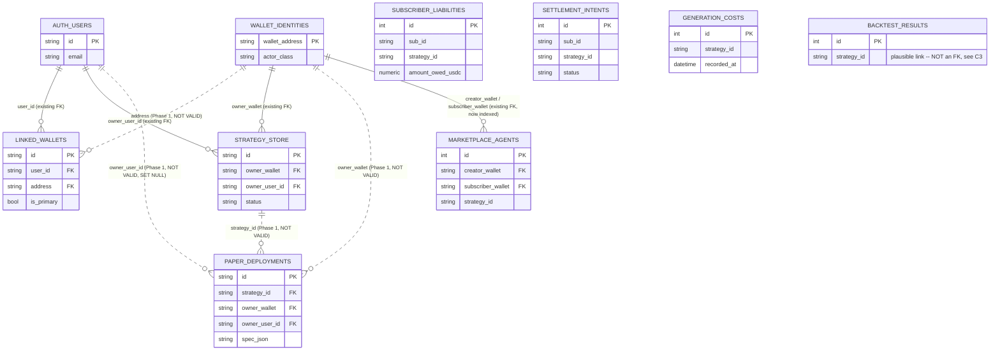

# Database Relations — Identity, Ownership, and the Schema-Relations Audit

> **status:** current
> **owner:** Dan Browne
> **updated:** 2026-08-31
> **superseded-by:** —

> **Amended 2026-08-31.** [PR #1438](https://github.com/aprin-labs/archimedes/pull/1438)
> **merged** (`526f99e7`), followed by [#1429](https://github.com/aprin-labs/archimedes/pull/1429)
> (`f2eb22ea`) reconciling the account-deletion policy with #1438's `paper_deployments` FK.
> The "**Nothing in § 2 is live**" paragraph below and the `pending merge` status were
> written while the PR sat in draft and are **no longer true** — § 2 describes shipped
> schema. Left in place rather than deleted so the sequencing (audit → draft → merge) still
> reads; anything below phrased as *would do* should now be read as *does*. § 4 Phase 2 is
> still a proposal, except G1.

Companion to [`database-architecture.md`](database-architecture.md) (the two-store
overview). This doc is scoped narrower: the **relational structure between identity,
ownership, and money tables** — where a foreign key or an index is missing, what an
audit of that gap found once every claim was checked against the actual code, and what
[PR #1438](https://github.com/aprin-labs/archimedes/pull/1438) introduces in response.

**Nothing in § 2 is live.** PR #1438 is an unmerged draft — Dan reviews any migration
touching prod before it merges. Everything below describes what that PR *would* do if
merged, not the current state of prod. Phase 2 (§ 4, write-path changes) is a proposal
only — none of it is built *by this PR*, and it is not part of PR #1438's scope either
way. One Phase 2 item, **G1**, shipped independently on `main` on 2026-08-21 while this
PR sat in draft; § 1.2 and § 4 record that rather than leaving the original "not
persisted anywhere" claim standing.

## 1. Audit summary

An earlier pass proposed a schema-relations fix list. Before building anything, every
load-bearing claim in that proposal was checked against the running code. Three
corrections and one gap changed the plan; everything else held up. (A second candidate
gap, originally labeled G2, was re-examined during review and found not to hold — see
**C4** below.)

### 1.1 Corrections to the original audit

| # | Original claim | Verified reality | Effect on the plan |
| --- | --- | --- | --- |
| **C1** | Every table's row count is "<5k everywhere" | The only in-repo **production measurement** is in [`backend/migrations/versions/f0ab58339d55_dedupe_backtest_results_canonical_hash.py`](../backend/migrations/versions/f0ab58339d55_dedupe_backtest_results_canonical_hash.py) — *"Measured against production 2026-08-20 (read-only query): **646 rows over 51 distinct strategies**"* — and that migration then collapses most of them. Every other table's count is **unverified**. Separately, this repo's 2026-07-05 data-architecture audit found prod Aurora already contains unjoinable/orphaned populations on identity/ownership columns — i.e. "unverified" here does not mean "probably zero," it means "known to include at least some nonzero cases elsewhere in the schema." | A plain `CREATE INDEX` migration is safe at this scale, but no FK may be added in a form that scans and validates existing rows — see § 2.3's `NOT VALID` design. |
| **C2** | Alembic migrations are *the* schema path | [`backend/migrations/env.py`](../backend/migrations/env.py) states the two-path design explicitly: **Alembic owns Postgres/prod; `Base.metadata.create_all()` owns SQLite (all tests + local dev)**. [`backend/tests/test_alembic_migrations.py`](../backend/tests/test_alembic_migrations.py)'s parity gates compared **columns only**, never constraints or indices, before this PR. | A Postgres-`NOT VALID` migration is architecturally legal and breaks no existing gate — but also meant constraint drift between the two paths was previously undetected. PR #1438 extends the parity tests for the two tables it touches (`linked_wallets`, `paper_deployments`) to also compare **index names/columns and FK targets** (`_index_signature` / `_fk_signature` in `test_alembic_migrations.py`), not just column names — see § 3. |
| **C3** | `backtest_results.strategy_id` has no FK to `strategy_store.id`, framed as a plain oversight | Both id spaces are the *same value in practice* — [`main.py`](../backend/archimedes/main.py) seeds every provider strategy into `strategy_store` with `id=s.id`, and [`strategy_provider.py`](../backend/archimedes/services/strategy_provider.py) syncs the same objects into `strategy_passports`. **But both writers are explicitly best-effort**: `main.py` logs *"startup: example strategy seed failed (non-fatal)"* on exception, and `strategy_provider.py` logs *"unified table sync failed (non-blocking)"*. | The invariant is **plausible, not provable**. This PR does **not** add that FK. Doing so on unverified data would be exactly the mistake the `NOT VALID` pattern (§ 2.3) exists to avoid. |
| **C4** | (Originally filed as gap "G2") `paper_deployments` is excluded from `claim_legacy_wallet_data`'s account-adoption sweep, so a paper deployment made before a wallet link is permanently unreachable by its owner | Re-checked against the actual write path: [`paper_routes.py`](../backend/archimedes/api/paper_routes.py)'s module docstring states plainly *"every route requires a Better Auth session and every deployment is owned by `owner_user_id`"* and *"the table shipped with this feature, so there are no legacy wallet-owned rows and no fallback tier."* `deploy_paper()` always creates the row with `owner_user_id=user.id` from an authenticated session (never `None` on the only production call path), and both `_owned_deployment()` and `list_paper_deployments()` key on `owner_user_id` alone — `owner_wallet` is "provenance only... it never grants access" per the same docstring. There is no pre-account, pre-wallet-link `paper_deployments` row for `claim_legacy_wallet_data` to ever need to backfill: `owner_user_id` is populated at INSERT time, unconditionally, on every row that exists in prod. | **Not a real gap.** Adding `PaperDeployment` to `claim_legacy_wallet_data`'s model tuple would be inert — the `model.owner_user_id.is_(None)` filter that drives that sweep would never match a `paper_deployments` row. Dropped from the gap list and from the Phase 2 proposal (§ 4 no longer lists it). |

### 1.2 One gap the original audit missed — since closed on `main`

**G1 — Generation revenue was not persisted anywhere. Closed by
[PR #1456](https://github.com/aprin-labs/archimedes/pull/1456), not by this PR.**

As originally audited (2026-08-20),
[`services/generation_payment.py`](../backend/archimedes/services/generation_payment.py)
verified and settled a real USDC payment through the Circle facilitator and then sent
`payer`, `amount`, and `transaction` to **a log line and nowhere else** — no table, no
model, so "how much has a user paid" was unanswerable from the database. That was filed
as a Phase 2 item because closing it needs a writer change.

**Re-verified 2026-08-30, when this branch was merged up to `main`: it landed
independently in the interim and this finding is now stale.**
[`1752121b8d7c_add_payment_receipts.py`](../backend/migrations/versions/1752121b8d7c_add_payment_receipts.py)
creates `payment_receipts`, backed by `PaymentReceiptRecord`
([`models/payment_receipt.py`](../backend/archimedes/models/payment_receipt.py)) — one row
per settled payment carrying `user_id`, `payer_wallet`, `amount_base_units`, `price_usd`,
`network`, `settlement_ref`, a nullable `job_id`, and `created_at`, indexed
`ix_payment_receipts_user_id`. It is written at the settle site
(`generate_routes.py`'s `_persist_payment_receipt`) and read back by `GET
/api/payments/receipts`. The aggregate question G1 named is now answerable from Postgres.

Two things that remain true and are **not** claimed closed by the above:

- **The receipt write is deliberately fail-safe** — `_persist_payment_receipt` swallows
  every exception because the payment has already cleared and a receipt failure must
  never fail the paid generation. So a `payment_receipts` row is best-effort, in exactly
  the sense C3 uses that word: the table answers "what did we record," not provably "what
  did we settle." Reconciliation against the facilitator is a separate question this doc
  does not address.
- **`payment_receipts.user_id` carries no FK to `auth_users.id`** — the same
  identity/ownership gap class this PR closes elsewhere. The table did not exist when
  `fb8d0bae8112` was authored, so it is **out of this PR's scope** rather than an
  oversight; it is a natural candidate for the next additive pass. `settlement_ref` is a
  Circle facilitator reference id, not an on-chain hash, and must never be linked as one.

### 1.3 Confirmed as originally stated

- **A1** — no FK between `linked_wallets.address` and `wallet_identities.wallet_address`;
  `.address` was entirely unindexed (`models/account.py`). **Addressed in PR #1438** (§ 2).
- **A2** — `claim_legacy_wallet_data` filters `model.owner_user_id.is_(None)`: it fills a
  NULL owner, it never corrects a mismatched one. Unchanged by this PR (behavioral, not
  schema).
- **A3 / B2** — documented anti-goal in `generation_cost.py`: the cost-measurement table
  is deliberately price-free (`assert_measurement_only` raises if a price leaks in).
- **B3 / B4** — `strategy_provider.py`'s `fixture = self._fixtures.get(path.stem)` is the
  only stem↔id bridge in the curated-strategy loader.

## 2. Phase 1 — what PR #1438 introduces (unmerged)

Additive only, no writer changed. Three classes of schema change, plus a deploy-safety
mechanism that spans two migration revisions:

### 2.1 Ten indices

Postgres does not auto-index foreign-key columns, and several of these composite indices
existed but led with the wrong column for the query shape that actually runs.

| Index | Table (columns) | Why |
| --- | --- | --- |
| `ix_linked_wallets_address` | `linked_wallets(address)` | The sole bridge between Better Auth and the SIWE ledger (A1) was a full seq scan on every "which account owns wallet W" query. |
| `ix_paper_deployments_owner_user_id` | `paper_deployments(owner_user_id)` | `paper_routes.py` filters exactly this column to list a user's deployments — the user-facing hot path — with no index. |
| `ix_identity_events_wallet_time` | `identity_events(wallet, occurred_at)` | Existing indices are `(wallet, event_type)` — no `occurred_at` column, so it can filter to one user but not scan efficiently by time — and `(event_type, occurred_at)` — no `wallet` column at all, so it can't even filter to one user. Neither serves "one user's activity over time." |
| `ix_subscriber_liabilities_sub` | `subscriber_liabilities(sub_id)` | This table carried **zero** indices before this PR, on a table holding `amount_owed_usdc`. |
| `ix_subscriber_liabilities_strategy_created` | `subscriber_liabilities(strategy_id, created_at)` | Same table, revenue-over-time shape. |
| `ix_settlement_intents_sub` | `settlement_intents(sub_id)` | The one existing index leads with `strategy_id`, so "settlements for subscriber X" seq-scans. |
| `ix_settlement_intents_status_created` | `settlement_intents(status, created_at)` | Same table, revenue-over-time shape. |
| `ix_marketplace_agents_subscriber_wallet` | `marketplace_agents(subscriber_wallet)` | Already an FK column; Postgres never auto-indexes those. |
| `ix_marketplace_agents_creator_wallet` | `marketplace_agents(creator_wallet)` | Same. |
| `ix_generation_costs_recorded_at` | `generation_costs(recorded_at)` | Cost-over-time is a core owner metric; only `strategy_id` and `(job_id, strategy_id)` were indexed. |

Built with plain `CREATE INDEX`, deliberately **not** `CONCURRENTLY` — `CONCURRENTLY`
cannot run inside Alembic's transaction (it forfeits atomic rollback and can leave an
`INVALID` index behind on failure), and at this repo's only measured production scale
(C1: 646 rows) a plain index build is milliseconds. A brief `SHARE` lock is the better
trade — bounded by a `SET lock_timeout = '5s'` at the top of the migration (§ 2.3) so a
blocked acquire fails fast and cleanly instead of queuing behind live traffic.

### 2.2 One column widen (the one honestly-irreversible piece)

`paper_deployments.strategy_id` — `VARCHAR(64)` → `VARCHAR(128)`, matching
`strategy_store.id`'s width ahead of the FK below. Legal in Postgres (both are
`character varying`, same operator family — a widen is metadata-only, no table rewrite).
Actual values are `content_hash[:16]` (16 characters), so this is headroom, not a
live-data change.

**The downgrade direction is not unconditionally safe**, and the migration says so rather
than claiming blanket reversibility: narrowing back to `VARCHAR(64)` fails on any row
whose `strategy_id` is actually longer than 64 characters. The migration's `downgrade()`
checks for that case first (`_fail_if_narrow_would_truncate` — Postgres + online only; a
no-op on SQLite, which never enforces `VARCHAR(N)` length, and on `alembic downgrade --sql`,
which has no live rows to check) and raises a clear, named error instead of letting a
generic Postgres "value too long" error stand in for it. If any row has actually grown
past 64 characters by the time a downgrade is attempted, this widen is a one-way door in
practice — the indices and FKs (§ 2.3) are the genuinely reversible parts of this PR.

### 2.3 Four foreign keys, added `NOT VALID` and validated in a separate follow-up revision

| FK | Columns | `ON DELETE` |
| --- | --- | --- |
| `fk_linked_wallets_address_wallet_identity` | `linked_wallets.address` → `wallet_identities.wallet_address` | `NO ACTION` |
| `fk_paper_deployments_owner_user_id` | `paper_deployments.owner_user_id` → `auth_users.id` | `SET NULL` (matches the five identical FKs `b7e3f1a2c9d4` already added to sibling ownership columns) |
| `fk_paper_deployments_strategy_id` | `paper_deployments.strategy_id` → `strategy_store.id` | `NO ACTION` |
| `fk_paper_deployments_owner_wallet` | `paper_deployments.owner_wallet` → `wallet_identities.wallet_address` | `NO ACTION` |

This is split across **two Alembic revisions**, not one:

1. [`fb8d0bae8112`](../backend/migrations/versions/fb8d0bae8112_schema_relations_phase1.py)
   — the ten indices, the column widen, and all four FKs added **`NOT VALID`**. A plain
   `ADD CONSTRAINT ... FOREIGN KEY` (no `NOT VALID`) scans and validates every existing row
   as part of adding the constraint, and **aborts the whole statement** on the first
   violation — on a repo where a real 2026-07-05 audit already found unjoinable/orphaned
   populations on exactly this kind of identity/ownership column, that turns an additive,
   supposedly-safe migration into a deploy-time hard failure. `NOT VALID` is what makes
   "the constraint exists and enforces every future write" unconditionally safe to ship
   regardless of what prod's row counts turn out to be. This revision also sets a bounded
   `SET lock_timeout = '5s'` before touching any table, so a blocked `ACCESS EXCLUSIVE`
   lock acquisition fails fast (the whole migration is one transaction, so a timeout
   aborts cleanly with no partial schema change — safe to retry) instead of queuing behind
   live traffic.
2. [`9c2e7b5a1f4d`](../backend/migrations/versions/9c2e7b5a1f4d_schema_relations_phase1_validate.py)
   — the ONLY place any of the four constraints is passed to `VALIDATE CONSTRAINT`, gated
   on a live orphan-count query run against this migration's own connection immediately
   before each attempt. An orphan count above zero is not a failure: it is the documented,
   expected outcome for `fk_paper_deployments_strategy_id` / `.owner_wallet` (no historical
   backfill has ever run against those columns), and it simply leaves that one constraint
   `NOT VALID` — already enforcing all future writes, historical rows untouched — while the
   migration still completes successfully and prints which constraint(s) it left
   unvalidated and why. This is the "operator-free follow-up" the no-operator-rituals
   principle calls for: nothing here requires a human to eyeball a count or run a manual
   SQL script before it is safe to deploy.

   Splitting the FK-adding step from the validating step into separate revisions means an
   unexpected failure during validation (a race with a concurrent write, or any other
   runtime surprise in the table scan `VALIDATE CONSTRAINT` performs) cannot roll back the
   indices/widen/`NOT VALID` constraints from step 1 along with it. One caveat stated
   honestly: `migrations/env.py`'s `run_migrations_online()` wraps a WHOLE `alembic
   upgrade` invocation in one transaction (no `transaction_per_migration=True`), so if both
   revisions are applied via a single `alembic upgrade head` call — the normal case for
   this repo's build-on-deploy pipeline — they still share that transaction. What the split
   still buys under that default: the *expected* failure mode (a known orphan population)
   is turned into a log line by the live gate, never a raised exception, so it cannot
   trigger a shared-transaction rollback in the first place. Genuine transaction isolation
   for a prod deploy with unmeasured orphan counts is available today by running `alembic
   upgrade fb8d0bae8112` and confirming it before `alembic upgrade head` — two invocations,
   two transactions, no code change required. Changing `env.py`'s transaction model
   globally is a separate, bigger decision, out of scope for this PR.

The orphan queries both revisions use are the same shape the original audit specified for
a human to run by hand (kept byte-identical between the two revisions — see
`test_phase1_validate_orphan_sql_matches_source_revision` in `test_alembic_migrations.py`):

```sql
-- fk_linked_wallets_address_wallet_identity
SELECT COUNT(*) FROM linked_wallets lw
  LEFT JOIN wallet_identities wi ON lw.address = wi.wallet_address
 WHERE wi.wallet_address IS NULL;

-- fk_paper_deployments_owner_user_id
SELECT COUNT(*) FROM paper_deployments pd
  LEFT JOIN auth_users au ON pd.owner_user_id = au.id
 WHERE pd.owner_user_id IS NOT NULL AND au.id IS NULL;

-- fk_paper_deployments_strategy_id
SELECT COUNT(*) FROM paper_deployments pd
  LEFT JOIN strategy_store ss ON pd.strategy_id = ss.id
 WHERE ss.id IS NULL;

-- fk_paper_deployments_owner_wallet
SELECT COUNT(*) FROM paper_deployments pd
  LEFT JOIN wallet_identities wi ON pd.owner_wallet = wi.wallet_address
 WHERE pd.owner_wallet IS NOT NULL AND wi.wallet_address IS NULL;
```

`NOT VALID` / `VALIDATE CONSTRAINT` have no SQLite equivalent; on SQLite `fb8d0bae8112`
adds the same named constraints in FULL (via `batch_alter_table`'s table-rebuild path —
this repo's established two-path pattern), and `9c2e7b5a1f4d` is a no-op there — a real
orphan on SQLite becomes a live app-level FK violation the next time that row is touched,
the correct SQLite-native failure mode for a fresh/local database, not a prod-outage risk
on an unmeasured table.

Both migrations are offline-renderable (`alembic upgrade --sql`) — no live-bind query runs
in `fb8d0bae8112`'s `upgrade()` at all, and `9c2e7b5a1f4d` guards its orphan check with
`context.is_offline_mode()`, rendering the unconditional `VALIDATE CONSTRAINT` statements
for review instead. See the PR body for the full rendered SQL.

### 2.4 Explicit skip

No FK from `backtest_results.strategy_id` to `strategy_store.id` — see C3 above. Adding
it on unverified data is exactly what the `NOT VALID` pattern exists to prevent doing blind.

## 3. Target ERD (post-Phase-1, if merged)

Solid lines are FKs that existed before this PR (fully enforced). Dashed lines are the
**four** FKs this PR adds `NOT VALID` — enforced for every future write, validated against
historical rows only where a live orphan count comes back zero (§ 2.3).



`BACKTEST_RESULTS` is drawn with no relationship line to `STRATEGY_STORE` on purpose — the
plausible-but-unproven link from C3 is the point being made visually: everything else on
this diagram is either a real constraint or an explicit, reasoned skip.

## 4. Phase 2 — proposal, not built by this PR

None of this is part of PR #1438: it needs a writer change, which is why it is excluded
from an additive-only Phase 1. **One item is no longer a proposal at all** — G1 shipped
on `main` on 2026-08-21 (below). The rest remains unbuilt.

**G1 — persist generation revenue. ~~Proposed here~~ — done on `main`, not by this PR.**
The proposal was a `generation_payments` table (payer, amount, transaction reference,
strategy/job linkage, timestamp) written where `generation_payment.py` only logged. It
shipped as `payment_receipts` in
[PR #1456](https://github.com/aprin-labs/archimedes/pull/1456) (revision `1752121b8d7c`) on
2026-08-21, while this PR was still an open draft — see § 1.2 for the verified shape and
for the two caveats that survive it (the write is fail-safe, and `user_id` has no FK yet).
**Nothing is left of G1 for Phase 2 to build.** Its remaining relational residue — an FK
from `payment_receipts.user_id` to `auth_users.id` — belongs to the next additive pass,
alongside Phase 1's four, not to a write-path phase.

**Related, deliberately not proposed:** the `backtest_results.strategy_id` FK from C3.
Both writers that establish the id-space equality are best-effort / non-fatal on failure;
making either one durable (so the invariant becomes provable, not just plausible) is a
precondition for that FK, not a Phase 2 line item in its own right.

**Also deliberately not proposed:** adopting `paper_deployments` into
`claim_legacy_wallet_data` (the original "G2"). See **C4** in § 1.1 — re-verification
during review found the scenario it was meant to fix cannot occur, so there is nothing
here for Phase 2 to fix.
