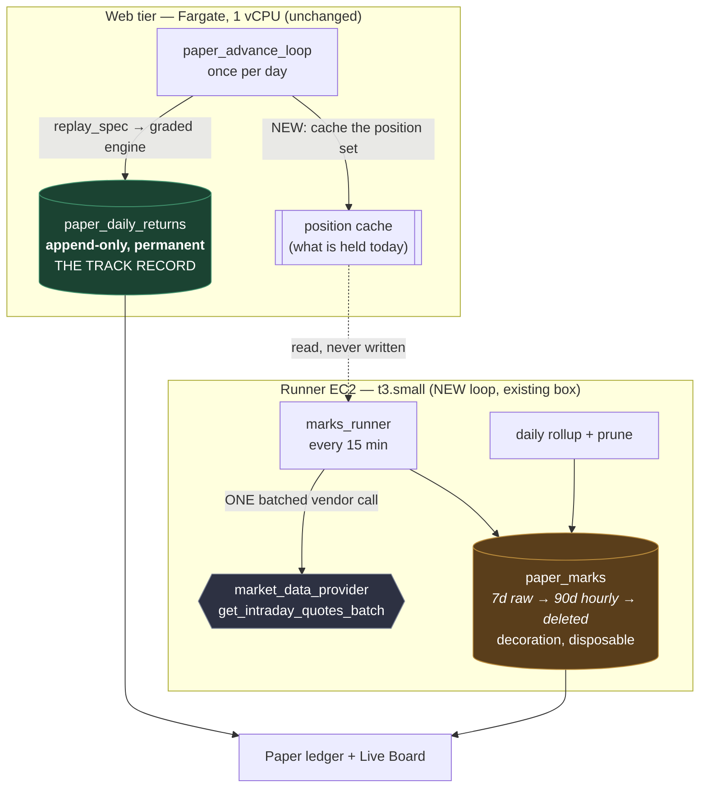

# Intraday Paper Trading

> **status:** draft
> **owner:** Dan Browne
> **updated:** 2026-09-03
> **superseded-by:** —

> **Corrected 2026-09-03 ([#1807](https://github.com/aprin-labs/archimedes/issues/1807)).**
> Two sentences in this plan said the settled ledger "carries to mainnet". The Arc mainnet
> cutover was cancelled by owner call on 2026-08-30
> ([#1240](https://github.com/aprin-labs/archimedes/issues/1240)): Archimedes stays a testnet
> product until legal/regulatory review and sustained traction justify charging real money, and
> we do not name a date. Both sentences now say what is true — the settled ledger is a paper
> track record on Arc testnet, with no real funds. Nothing else about the design changed.

**The directive (Dan, 2026-08-30):** *"daily returns is too slow — users want to see their
strategies play out closer to real time; intraday is a huge unlock."* This is a v8 Lane 3.5
modification: paper trading already ships, and this changes how often the user sees it move.

**The recommendation in one paragraph.** Ship **mark-to-market at a 15-minute cadence on the
positions the daily engine already holds** — a new `paper_marks` table, a small polling loop on
the existing runner box, and a "last marked HH:MM" value on the paper ledger. Do **not** ship
intraday *signal evaluation* this week. Re-pricing a position more often is a display change and
is honest. Re-deciding the position more often is a **different strategy** from the one the rigor
gate graded, and this repo has already been burned by exactly that (divergence audit F3 — see
§1.3). Marks are v1 and land this week; intraday signals are v2 behind an ADR.

---

## Contents

1. [What "intraday" honestly means for v1](#1-what-intraday-honestly-means-for-v1)
2. [Where the prices come from](#2-where-the-prices-come-from)
3. [Schema: `paper_marks` and its retention policy](#3-schema-paper_marks-and-its-retention-policy)
4. [Engine changes: the marks loop, and where it runs](#4-engine-changes-the-marks-loop-and-where-it-runs)
5. [UI: the paper ledger and the Live Board](#5-ui-the-paper-ledger-and-the-live-board)
6. [Phased plan](#6-phased-plan)
7. [Open questions and out-of-scope items](#7-open-questions-and-out-of-scope-items)

---

## 1. What "intraday" honestly means for v1

There are two completely different things a user could mean by "I want to see it intraday", and
they have wildly different costs and risks.

| | **A. Intraday marks** (v1, this week) | **B. Intraday signals** (v2, needs an ADR) |
|---|---|---|
| What changes | How often we **re-price** the position | How often the strategy **re-decides** the position |
| Position set comes from | The daily replay, unchanged | A new intraday evaluation |
| Does the strategy behave differently? | **No** | **Yes — it is a different strategy** |
| Does the graded verdict still apply? | Yes | **No** — needs re-grading |
| DSL work required | None | Substantial (§1.3) |
| Size | S–M | L, plus a rigor-lane sign-off |

### 1.1 The recommendation: marks, not signals

**v1 = a 15-minute mark-to-market on open paper positions.**

Concretely: every 15 minutes, for each active deployment, fetch the current price of each symbol
in its universe, apply it to the position set the daily replay last established, and write one
row saying "at 14:45 UTC this portfolio was worth index 1.0347". The user sees a number that
moves during the day. Nothing about *what the strategy does* changes.

This is honest because it is exactly what a brokerage statement does between trades. The position
is whatever the strategy last decided; the value of that position moves continuously because
prices move continuously. Saying "your paper portfolio is up 0.4% since the open" is a true
statement about a position we actually hold in simulation.

### 1.2 The cadence: why 15 minutes and not 1 minute

15 minutes is the recommendation, but the number should be a config knob
(`PAPER_MARKS_INTERVAL_MINUTES`, default 15) rather than a constant, because the tradeoff is
genuinely a product call:

- **1 minute** is what the oracle already polls at (`ORACLE_INTERVAL_SECONDS=60`,
  `backend/archimedes/chain/oracle_runner.py:39`). It is technically available today. It produces
  **16× the rows** of a 15-minute cadence for a chart the eye cannot resolve, and for equities it
  is mostly noise against a delayed feed (§2.4).
- **15 minutes** gives 26 marks across a US equity session and 96 marks across a crypto day. That
  is enough points to draw a moving intraday line, and it is a retention profile that stays bounded
  (§3.2).
- **Slower than 15 minutes** stops feeling live, which defeats the directive.

Two cadence subtleties that must be built in from the start rather than retrofitted:

- **Equities have market hours; crypto does not.** A deployment whose universe is all crypto marks
  24/7 (96 marks/day). A deployment on `SPY` marks only during the session (26 marks/day) and its
  value is genuinely *frozen* overnight and at weekends. The UI must show the mark's timestamp so a
  frozen number reads as "last marked Friday 16:00", not as a broken ticker. **This exact failure
  is already open elsewhere in the product** — #1378, "Explore '24h' change label is a misnomer
  across weekends/gaps" — so it is a known, repeated shape here, not a hypothetical. Whatever
  labeling convention resolves #1378 should be reused verbatim rather than invented twice.
- **A mixed universe is the awkward case.** A strategy holding both `sBTC` and `SPY` has a live leg
  and a frozen leg outside the session. v1 should mark what it can and record which symbols were
  fresh, rather than refusing to mark or silently carrying a stale equity price as if it were
  current. The `prices_json` column stores what was actually observed, per symbol, so this is
  recoverable rather than hidden.

### 1.3 Why intraday *signals* are v2 — the three concrete landmines

This is the section to re-read before anyone "just passes `interval="15m"` to the feed". The
existing code has three separate places where feeding intraday bars into the graded engine would
silently change strategy semantics with no error and no log.

**Landmine 1 — rebalance cadence is counted in BARS, not in calendar time.**

`backend/archimedes/services/dsl_to_backtrader.py:99`:

```python
_REBALANCE_PERIOD_BARS: dict[str, int] = {"daily": 1, "weekly": 5, "monthly": 21}
```

and `_should_rebalance` increments a counter once per bar. On daily bars, "weekly" means five
trading days. On 15-minute bars, **"weekly" means 75 minutes and "monthly" means 5¼ hours.** The
spec still *says* `"rebalance_frequency": "weekly"`, the passport still says weekly, the UI still
says weekly — and the strategy is trading roughly a hundred times more often than it claims.
Nothing raises. The docstring is explicit that these are "Trading-day proxies, NOT calendar months",
which is fine for a daily-bar engine and is a trap for anything else.

**Landmine 2 — indicator warmup is counted in bars too.**

`interpret_spec` derives `max_period` from indicator names (`sma_200` → 200). On daily bars that
is roughly ten months of history, which is what the strategy author meant. On 15-minute bars it is
**~7.7 equity sessions (26 bars/session), or ~2 days on a 24/7 crypto feed.** A "200-day moving
average" strategy quietly becomes a week-and-a-half moving average — and on crypto, a two-day one
— which is a different strategy with a different risk profile and a verdict that was never
computed for it.

**Landmine 3 — we have already lived this failure, and it is recorded in the tree.**

`backend/archimedes/services/strategy_signal_evaluator.py:1095`, describing divergence audit F3:

> the live path never read `rebalance_frequency` at all (audit F3), so a spec declaring monthly
> cadence was re-decided on every one of the ~288 ticks a day

That is the exact shape of the mistake — a fast tick loop re-deciding a slow-cadence strategy —
and it is why `paper_store.py`'s own module docstring already says paper trading is the *backtest*
engine forward-run and explicitly **not** the live signal evaluator, "because the divergence audit
(F2/F3) established it grades a different strategy". Intraday signals would walk straight back into
the thing that design decision was made to avoid.

**What v2 actually requires** (time-bounded, so it can be scoped rather than dreaded):

1. Open the closed enum. `REBALANCE_FREQUENCIES = frozenset({"daily", "weekly", "monthly"})`
   (`strategy_dsl.py:22`) has no intraday member. Adding one touches the validator, the passport
   column (`strategy_passport_record.rebalance_frequency`, `String(32)`), and the generation
   prompt that lists valid values (`agents/strategy_fusion.py:789`).
2. Make cadence and warmup **calendar-aware** rather than bar-counted, in both interpreters, with
   `test_interpreter_parity.py` extended to pin the pair on intraday bars the way it pins them on
   daily bars today.
3. Re-grade. A strategy evaluated intraday has a different return series, so its Sharpe, DSR, and
   PBO are different numbers. The rigor gate must re-run; the old verdict cannot be reused. This is
   Önder's lane and needs his sign-off, not just an engineering merge.
4. Source intraday history for backtests, not just intraday quotes for marks. §2 covers quotes;
   backtesting an intraday strategy needs years of intraday bars, which is a materially more
   expensive data product than daily bars (and is precisely the cost driver #1218 flags).

**Time-box: a 2-week spike ending in an ADR, not a build.** Steps 1–2 are the spike; step 3 is the
gate; step 4 is a cost question that #1218 already owns.

---

## 2. Where the prices come from

Everything below routes through the existing vendor seam,
`backend/archimedes/services/market_data_provider.py` (#1218/#775). That seam already has exactly
the two methods a marks loop needs — `get_intraday_quote(ticker)` and
`get_intraday_quotes_batch(tickers)` — and both are documented as deliberately **uncached**, "a
stale daily close must never masquerade as a live push/guardrail reading". That is the right
property for marks too. **No new fetch path is needed — but the batch method has to be widened
first, and that is item 0 of the plan, not a footnote.**

**The prerequisite: `get_intraday_quotes_batch` must return the bar timestamp, not just the
price.** Today it returns `dict[str, float]`. §2.4's honesty rules are unbuildable on that: a mark
must store *when the price was observed upstream* (rule 1), and the stale-bar guard (rule 4) has
nothing to compare against without it. The signature widens to
`dict[str, tuple[float, datetime]]` — exactly the shape `get_intraday_quote` already returns for a
single ticker. Blast radius, verified 2026-08-30:

| Site | What changes |
|---|---|
| `market_data_provider.py:127` — the `MarketDataProvider` ABC | The abstract signature and its docstring. Everything below follows from this one line. |
| `:235` — `YFinanceProvider.get_intraday_quotes_batch` | **The timestamp is already in hand and thrown away.** The method holds the whole `yf.download` frame and reads only `Close`; the per-symbol bar time is `close[yf_ticker].dropna().index[-1]`, and the single-ticker sibling at `:219` already does precisely this with `data.index[-1]` (tz-normalized to UTC). Copy that four-line pattern per symbol. |
| `:614` — `CachingMarketDataProvider` | A one-line pass-through delegate; annotation only. It must stay a pass-through — intraday is uncached by design. |
| #1455's `TiingoProvider` | Its intraday stub already raises `NotImplementedError` (§2.3), so it changes signature and keeps raising. No new work, but the PR must not land after this change without picking it up. |
| `chain/oracle_updater.py:678` — the only production caller | Unpacks `price` today; unpacks `(price, bar_ts)` after. |
| `backend/tests/services/test_market_data_provider.py` | Three doubles implement the ABC and widen with it (`_FakeVendor:90`, `_FakeOhlcvVendor:134`, `_FakeVendorPassthroughSpy:282`), plus two assertions that pin the return shape (`:256`, `:498`). |

The `oracle_updater` row carries a bonus worth naming, because it is a live honesty gap rather
than plumbing: `_fetch_yfinance` stamps `AssetPrice(timestamp=timestamp)` with the *poll* time
(`oracle_updater.py:681`, `now` from `fetch_prices`), and `_validate_for_push` computes `age_s`
from that same field (`:478-481`). On the yfinance path the staleness gate is therefore comparing
now against now, and **cannot reject a stale bar** — while `fetch_prices`'s own docstring claims
"every price keeps its true `source` + upstream timestamp so the on-chain push staleness/deviation
gates stay meaningful" (true of the Pyth cascade, which carries a real observation time; not true
of the yfinance batch). Widening the batch return makes that gate FIXABLE — but the fix itself was
split out (2026-08-30) and is **not** part of item 0.

**Why the split.** Stamping the bar time on the `AssetPrice` does close the gate — and it also
stops every off-hours equity push, because a Friday-close bar is tens of hours past
`ORACLE_MAX_UPSTREAM_STALENESS_SECONDS` (900s). `sSPY` would hold its last weekday value on-chain
across the weekend instead of being re-pushed at a fresh block time. That is a live-chain behavior
change with weekend-freshness consequences (#1528) and needs the owner's ack, so it does not ride
along inside a paper-trading PR. It lives on `dbrowneup/oracle-bar-time-stamp` (stacked on the
marks branch, which is its prerequisite), with an executed off-hours test and its in-session
counterpart. The marks branch unpacks the tuple, discards `bar_ts`, and pins the poll-time stamp
with a regression test so the change cannot re-enter under cover of a paper PR. Size **S–M** for
the seam; the on-chain stamp is its own review.

### 2.1 The three options

| Option | Cost | Coverage | Cadence ceiling | Ready today? |
|---|---|---|---|---|
| **A. Extend the existing yfinance loop** | $0 cash | All 281 SSOT symbols | ~1 min | **Yes** |
| **B. Tiingo IEX intraday** | Subscription — **not yet quoted** | Equity/ETF; IEX tape only | Real-time-ish | **No** — needs work on #1455 |
| **C. Perp City index API** | Partnership terms — unknown | Whatever their index covers | Unknown | **No** — no integration exists |

### 2.2 Option A — extend the existing yfinance loop (recommended for v1)

**What it is.** The oracle runner already calls `get_intraday_quotes_batch` once every 60 seconds
for the live synth set (`YFINANCE_MAP` is currently just `sSPY` plus the two regime indices, with
`sBTC` coming from CoinGecko). The marks loop does the same call with a different ticker list: the
union of every active deployment's resolved universe.

**Why it is cheap.** `YFinanceProvider.get_intraday_quotes_batch` issues **one** `yf.download` for
the whole ticker list, not one per ticker. So the vendor-call count is driven by tick cadence, not
by deployment count or universe breadth:

| | Calls/day |
|---|---|
| Oracle runner today (60s) | ~1,440 |
| Marks loop at 15 min, equity session only | 26 |
| Marks loop at 15 min, crypto 24/7 | 96 |

Adding marks is roughly a **7% increase** on the vendor call volume this repo already generates.
That is the honest argument for starting here: it is the option that does not require a new
contract, a new secret, or a new provider implementation.

**Rate limits and the real risk.** Yahoo's endpoint is unofficial, has no SLA, no published rate
limit, and no support (#1218 states this plainly). The batching keeps us far from any plausible
throttle. The genuine risk is not throttling — it is that **#1218's licensing problem gets worse,
not better.** Daily bars for backtests are a defensible research use. Polling a live-ish price
every 15 minutes to render a moving number on a user-facing page is much closer to redistribution,
and it lands on the same commercialization trigger date #1218 names. This should be recorded as a
comment on #1218 when v1 merges, so the cost-and-license reckoning accounts for it.

### 2.3 Option B — Tiingo IEX intraday (pairs with #1455 / #1218)

**The state of play, verified 2026-08-30:** PR #1455 adds `TiingoProvider` behind this exact seam
— but its own scope section is explicit that the intraday methods are deliberately **not**
implemented:

> `get_intraday_quote`, `get_intraday_quotes_batch`, and `get_series` raise `NotImplementedError`
> on `TiingoProvider`. … **Cutover impact:** flipping `MARKET_DATA_PROVIDER=tiingo` today will make
> those three call sites fail loud immediately.

So Tiingo is not a drop-in for marks. It is a **follow-up to #1455** that wires Tiingo's IEX
endpoint into those two methods. That is a well-shaped, well-precedented piece of work — #1455 has
already built the auth, the symbol routing, the error taxonomy, and 48 hermetic tests to copy —
but it is not free and it is not this week.

Two honesty constraints that come with IEX specifically:

- **IEX is one venue, not the consolidated tape.** IEX handles a minority of US equity volume. An
  IEX last-trade price is a real trade at a real price, but it is not "the" market price, and for a
  thin ETF it can be meaningfully stale or off. If we use it, the label is *"last IEX trade"*, not
  *"market price"*, and `paper_marks.source` records which it was.
- **Coverage is narrower than the SSOT.** #1455's classifier already refuses index (`^`) and
  futures (`=F`) tickers loudly. The 71 crypto and 30 FX entries route to Tiingo's crypto/FX
  endpoints, which are separate products with their own terms.

**Cost: not quoted.** Deliberately left blank rather than guessed. Putting an unverified
subscription price into a design doc is exactly the "numbers come from the live source, not a doc"
failure this repo has a rule about. **Action:** get a written quote for the IEX tier at our symbol
count and record it on #1218, which already owns the priced-replacement exercise.

### 2.4 The honesty constraint that applies to every option

**Delayed data must be labeled delayed, at the point the number is displayed.**

yfinance's 1-minute bars for equities are not real-time — they come off a consolidated feed with a
lag that Yahoo does not contract to bound. The oracle already treats this as a first-class
property: `DEFAULT_MAX_UPSTREAM_STALENESS_SECONDS = 900` refuses to push anything older than 15
minutes on-chain, and the #775 cross-check checks the secondary's *bar timestamp* before comparing
magnitudes precisely because "a stale reading was never validly comparable". (The *discipline* is
first-class; §2 shows the yfinance leg does not yet hand that gate a real observation time, which
is half of why item 0 exists.)

The marks path inherits that discipline:

1. **Store the observation timestamp, not just the write timestamp.** `paper_marks.ts` is when the
   price was observed upstream. A mark written at 14:47 from a 14:32 bar is a 14:32 mark.
2. **Store `is_delayed` and `source` as columns**, set by the fetch path from what the provider
   actually reported — not inferred at render time. This follows the repo's fail-soft principle:
   a claim the UI makes must be backed by a stored fact.
3. **The UI never renders a bare number.** It renders a value *and* its as-of time, and it says
   "delayed" when `is_delayed` is true. See §5.
4. **A stale mark is not written as a fresh one.** If the newest available bar is older than
   `PAPER_MARKS_MAX_STALENESS_MINUTES` (default 60), skip the write and log it. A missing mark is an
   honest gap; a duplicated stale mark is a fabricated flat line.

### 2.5 Option C — Perp City index API (partner angle)

There is **no Perp City integration in this repo today** — no client, no config key, no reference
in the tree (grep-verified). This is a partnership conversation, not an engineering option, and
this doc should not pretend otherwise.

What makes it interesting, if the conversation happens:

- **A partner feed sidesteps the #1218 licensing problem entirely**, which is the single largest
  strategic argument for it — larger than latency or coverage.
- **Crypto marks 24/7**, which is exactly the sleeve where option A's market-hours gap is most
  visible and most annoying.
- **But an index is not a tape.** An index API gives the level of *their* basket. It can mark a
  portfolio only if the portfolio's universe is that basket, or if they also expose per-constituent
  prices. Worth establishing in the first conversation, because the answer determines whether this
  is a data source or just a benchmark series.

**Recommendation:** treat as a business-development thread with a one-day spike attached, not as a
v1 dependency. Do not block anything on it.

---

## 3. Schema: `paper_marks` and its retention policy

### 3.1 The table

```sql
CREATE TABLE paper_marks (
    id              BIGSERIAL PRIMARY KEY,
    deployment_id   VARCHAR(32)  NOT NULL
                    REFERENCES paper_deployments(id) ON DELETE CASCADE,
    ts              TIMESTAMPTZ  NOT NULL,   -- UPSTREAM observation time, not write time
    prices_json     TEXT         NOT NULL,   -- {"SPY": 512.34, "BTC-USD": 61022.1}
    portfolio_value DOUBLE PRECISION NOT NULL, -- index, 1.0 == deploy-time capital
    source          VARCHAR(32)  NOT NULL,   -- provider_name() at fetch time
    is_delayed      BOOLEAN      NOT NULL,   -- honesty flag, carried through to the UI
    granularity     VARCHAR(8)   NOT NULL DEFAULT 'raw',  -- 'raw' | 'hourly'
    CONSTRAINT uq_paper_marks_dep_ts_gran UNIQUE (deployment_id, ts, granularity)
);
CREATE INDEX ix_paper_marks_dep_ts ON paper_marks (deployment_id, ts DESC);
```

Five design notes, each of which is load-bearing:

**`portfolio_value` is an index, not dollars.** `PaperDeployment` has no notional/capital column —
it stores `strategy_id`, ownership, `spec_json`, `deployed_at`, `status`, and the drift stamp, and
nothing else. There is no deployed capital amount anywhere in the system. Rendering "$10,347" would
require inventing the $10,000, and an invented number on a track-record page is precisely the class
of claim this repo exists to oppose. The index is 1.0 at deploy and matches how
`deployment_summary` already computes `equity_index` from the daily ledger.

**`source` and `is_delayed` are stored, not inferred.** Same reasoning as `asset_daily_bars.source`:
the row records which vendor produced it, so a future provider swap does not retroactively relabel
history, and the UI's "delayed" badge is reading a fact rather than guessing from a timestamp.

**`prices_json` stores what was actually observed, per symbol.** For a mixed equity+crypto universe
outside market hours, some legs are fresh and some are not. Storing the per-symbol map keeps that
recoverable instead of collapsing it into one opaque portfolio number.

**`granularity` marks rolled-up rows in place.** Rather than a second `paper_marks_hourly` table,
the daily rollup job writes `granularity='hourly'` rows and deletes the `'raw'` rows they cover.
One table, one query shape, and the unique constraint prevents a re-run from duplicating a rollup.

**Marks are NOT the track record.** `paper_daily_returns` remains append-only-by-law and remains
the recorded paper track record — Arc testnet, no real funds. `paper_marks` is a **decoration with
a TTL** and is safe to delete wholesale. That single sentence is what makes an aggressive retention
policy safe, and it should be in the model's docstring.

### 3.2 Retention — learning from tonight's `backtest_results` finding

**The lesson.** `backtest_results` reached 6.3 GB because it stores full `equity_curve_json` and
`monthly_returns_json` blobs per row with no retention policy and no size alarm. Nobody chose that;
it accumulated. A marks table is a *higher*-volume version of the same shape, so the policy has to
exist before the first row is written, not after the first bill.

**Volume arithmetic** (row ≈ 200 B all-in: ~24 B tuple header + ~33 B id + 8 B ts + ~70 B JSON for
a 3-symbol universe + 8 B value + ~20 B varchars + ~40 B index entry):

| Scenario, 15-min marks | Rows/deployment/yr | 100 deployments | 1,000 deployments |
|---|---|---|---|
| Equity session only (26/day × 252) | 6,552 | ~131 MB/yr | ~1.3 GB/yr |
| Crypto 24/7 (96/day × 365) | 35,040 | ~700 MB/yr | **~7.0 GB/yr** |

The bottom-right cell is `backtest_results` happening again, on a one-year horizon, and it is
reachable — 1,000 paper deployments is a *good* outcome for this product, not a stress scenario.

**The policy — three tiers, and the third tier is `DELETE`:**

| Age | What is kept | Env knob | Default |
|---|---|---|---|
| 0–7 days | Every raw 15-min mark | `PAPER_MARKS_RAW_RETENTION_DAYS` | `7` |
| 7–90 days | One mark per hour (last mark in the hour) | `PAPER_MARKS_HOURLY_RETENTION_DAYS` | `90` |
| > 90 days | **Nothing** — rows are deleted | — | — |

Beyond 90 days there is nothing worth aggregating to, because the daily close is *already* stored,
authoritatively and permanently, in `paper_daily_returns`. Rolling marks up to daily would duplicate
the ledger with a less-trustworthy copy — a second source of truth for the same fact, which is worse
than no copy.

**Steady state under this policy is bounded, not linear in time**, which is the whole point:

| | Rows/deployment at steady state | Bytes | 1,000 deployments |
|---|---|---|---|
| Crypto 24/7 | 672 raw (7d × 96) + 1,992 hourly (83d × 24) = **2,664** | ~533 KB | **~533 MB, flat** |
| Equity session | 130 raw (5 trading days × 26) + ~413 hourly (~59 trading days × 7) = **543** | ~109 KB | ~109 MB, flat |

**Three operational guards, each of which must be demonstrated to reject before it ships:**

1. **Per-deployment row cap.** Refuse to insert when a deployment already holds more than
   `PAPER_MARKS_MAX_ROWS_PER_DEPLOYMENT` (default 20,000 — roughly 7× the steady-state ceiling).
   This catches a runaway loop in minutes instead of in a quarterly bill.
2. **Row-count logging on every prune cycle**, at INFO, with total table rows and rows deleted, so
   the number is visible in CloudWatch without anyone running a query.
3. **Stop marking stopped deployments.** The marks loop filters `status == STATUS_ACTIVE`, the same
   filter `advance_all` already uses. A stopped deployment's track record is frozen by design; its
   marks should stop accumulating the moment the user hits Stop.

---

## 4. Engine changes: the marks loop, and where it runs

### 4.0 The picture

Two loops, two cadences, two tables — and only one of them is the track record.



The marks loop reads the position set and never writes it. That one-way arrow is the whole
safety argument: marks cannot change what the strategy does, because they have no path to do so.

### 4.1 The shape of the loop

```
every PAPER_MARKS_INTERVAL_MINUTES:
  1. load active deployments  (status == STATUS_ACTIVE)
  2. resolve each spec's universe -> vendor tickers
       (fusion_market_data.resolve_universe — the existing SSOT boundary)
  3. ONE batched fetch for the union of tickers
       (market_data_provider.get_intraday_quotes_batch)
  4. per deployment:
       - skip if every leg is staler than PAPER_MARKS_MAX_STALENESS_MINUTES
       - value the position set the daily replay last established
       - insert one paper_marks row
  5. once per day: roll 'raw' -> 'hourly', prune past retention, log counts
```

Step 4 is the only genuinely new logic, and it is deliberately small: it takes the position set as
given and applies prices to it. It does **not** call `run_dsl_backtest`, does **not** call
`_eval_condition`, and does **not** consult `rebalance_frequency`. That restraint is what keeps
marks from becoming signals by accident (§1.3), and it should be stated as an anti-goal in the
implementing issue.

There is one honest gap in v1 worth naming rather than hiding: `paper_trading.replay_spec` returns
**dated portfolio returns**, not a position vector. To value a position set, the marks loop needs
to know *what is held*. The cheapest v1 that is still honest is to derive the current holding from
the same replay the ledger already runs (the equity-weighted dollar-sleeve model in
`replay_spec`), cached once per day rather than recomputed every 15 minutes — a replay per
deployment every 15 minutes would be both slow and pointless, since the position only changes on a
daily bar. **Design decision: cache the position set at each daily advance; marks read the cache.**

### 4.2 Where it runs — the recommendation is the runner box

| Option | Verdict | Why |
|---|---|---|
| **Web tier** (Fargate, where `paper_advance_loop` lives today) | **No** | The task is `ecs_backend_cpu = "1024"` — **one vCPU**, shared between nginx and the backend container. #1411 measured generation at ~65% of that vCPU for ~48s per run, which is why admission control (#1408) exists at all. Adding an always-on polling loop to the most contended resource in the system is the wrong direction. |
| **Runner EC2** (`infra/runner_ec2.tf`, `t3.small`) | **Recommended** | Already runs `oracle_runner` + `agent_runner` as two containers off the *same* `archimedes-backend` ECR image. Already reaches Aurora and ElastiCache from the private subnets. Already proves this exact loop shape at a 60s cadence. Already has `RunnerLeaseGuard` for singleton enforcement. **Marginal infra cost: $0** — it is an existing, under-used box. |
| **#1411's Lambda offload target** | **Not for v1** | #1411 is a *spike* for a bursty 48-second batch job priced per invocation, and its ADR does not exist yet. A 15-minute always-on poll is the opposite shape: low duty cycle, long lifetime, VPC-bound. Revisit only if marks ever need per-deployment parallel compute, which the batched fetch specifically avoids. |
| **Scheduled Fargate** (`infra/kb_runner.tf` + EventBridge pattern) | **Fallback** | A real option with a working in-repo precedent if the runner box is ever retired. Costs more than $0 and adds cold-start latency per tick. Note it; do not build it. |

**Concretely:** a new `backend/archimedes/chain/marks_runner.py` beside `oracle_runner.py`, a third
`docker run` unit in `infra/runner-user-data.sh`, no new image, no new secret.

**On the lease — be precise about why it is there.** `RunnerLeaseGuard` exists because
`oracle_runner` and `agent_runner` are *funds-adjacent* singletons where a duplicate is a
double-signed transaction. **Marks are not funds-adjacent.** No money moves and the unique
constraint makes a duplicate insert a no-op. The lease is still worth taking, but for the honest
reason: **it prevents two copies from burning double the vendor quota** during a deploy overlap.
Say that in the module docstring rather than copying the funds-adjacent language across, because a
false safety claim is a defect even when the mechanism is identical.

### 4.3 What does *not* change

- `advance_deployment` writes the position cache (§4.1); `replay_spec`, the ledger append-only
  law, and drift detection are untouched.
- `deployment_summary`'s existing `series` field — untouched, so today's UI keeps working
  unchanged while the marks UI is built beside it.
- The DSL, both interpreters, and `test_interpreter_parity.py` — **untouched, and that is the point.**

---

## 5. UI: the paper ledger and the Live Board

### 5.1 The paper ledger (`ui/src/components/PaperTrading.jsx`)

Today each deployment card shows a `Sparkline` over `series[].equity_index` and a `total_return`
computed from whole days. Two additive changes:

- **A live value line under the total return:** the latest mark's `portfolio_value` as a percentage
  move, with its as-of time and a `delayed` badge when `is_delayed` is set. Never a bare number.
  Suggested copy: `+0.42% · as of 14:45 UTC · delayed`.
- **An intraday tail on the sparkline**, visually distinguished from the settled daily line — a
  lighter stroke or a dashed segment — so a user can see at a glance where the *recorded track
  record* ends and where the *unsettled intraday view* begins. This matters because only the daily
  ledger is the recorded track record.
- **A no-marks-yet state.** A deployment created between ticks, or one on `SPY` before the session
  opens, legitimately has zero marks. That renders as an em-dash with a reason — never a `+0.00%`,
  which is the exact bug `formatTotalReturn` was extracted to fix (an unmeasured day-0 ledger must
  not get a measured look, `paperCopy.js:71-84`). The `days === 0` discriminator has the same shape
  here: gate on *whether a mark exists*, never on its value, so a genuinely marked flat 0.00% still
  prints.
- **A marks-fetch-failure state.** The marks endpoint can fail while the deployment card itself
  loaded fine — a partial failure the current card has no shape for. Route it through the existing
  `paperErrorMessage(err)` (`paperCopy.js:96-102`) rather than inventing a second mapping, so a raw
  `Backend returned 503` still cannot reach the user. The card keeps showing the settled daily
  return and says the live value is unavailable; **it must not silently show the last mark it
  fetched as if it were current** — a stale number with a fresh-looking label is the same defect as
  a duplicated stale row (§2.4 rule 4), just in the UI.

Two things to get right, both of which have precedent in this component:

- **Poll, do not stream.** A 15-minute cadence does not justify an SSE channel. A `setInterval`
  refetch of a new `GET /api/paper/deployments/{id}/marks` is sufficient and adds no new
  infrastructure. The generation SSE stream has already cost this repo one reproducible
  drop-under-load incident (#891, since closed); a once-per-quarter-hour number is not worth
  re-opening that surface.
- **Announce the state, not just the number.** The `role="status"` live region already exists in
  this component (added so the Stop action would be announced). A silently-updating number is
  invisible to a screen-reader user; the as-of time should live in the accessible name.

All new copy goes in `ui/src/paperCopy.js` as pure functions and is unit-tested there — that file
exists (#1362) specifically so this component cannot "re-fabricate a freeze that doesn't happen, a
measured look for an unmeasured day-0 ledger, or a raw 'Backend returned NNN'". A `markLabel()` and
a `marksStalenessNote()` belong there, not inline in JSX.

### 5.2 The Live Board — and a naming flag

**There is no component called "Live Board" in the tree today.** The nearest surface is
`ui/src/components/Leaderboard.jsx`, and its header comment is unusually clear about what it is
allowed to claim:

> the forward axis (per-strategy StockBench + live paper-P&L) is **not scored yet** and is called
> out as "pending" in its own section, not rendered per row.

So there is a genuine decision for Dan here, and it should be made explicitly rather than by
whoever implements first:

- **(a) The Live Board is the Leaderboard's forward column, finally populated.** Marks would give it
  its first real forward number. **But ranking on it is a new claim** — an intraday mark is a noisy,
  delayed, unsettled quantity, and ordering users' strategies by it invites exactly the
  "strategies play out closer to real time" reading that turns a research tool into a casino
  scoreboard. The North Star pivot argues against this. If it happens, it needs Önder's sign-off on
  what is being ranked.
- **(b) The Live Board is a new surface**: all of the signed-in user's active paper deployments on
  one screen, updating together — a cockpit, not a ranking. **This is the recommendation.** It
  delivers the felt experience the directive asks for ("see strategies play out"), it requires no
  new claim about relative merit, and it reuses the exact same endpoint the ledger cards use.

**v1 ships (b) as a display-only view and leaves the Leaderboard's forward axis untouched and still
honestly marked "pending".** Populating a scored leaderboard column is a separate decision with a
separate reviewer.

---

## 6. Phased plan

Sizes are S (≤1 evening), M (2–3 evenings), L (a week-plus, needs its own ADR) — calibrated to
evenings-and-weekends capacity.

### Ships this week — v1

| # | Item | Size | Notes |
|---|---|---|---|
| 0 | Widen `get_intraday_quotes_batch` to `dict[str, tuple[float, datetime]]` (§2) | **S–M** | **Blocks items 3 and 4** — the observation timestamp and the stale-bar guard both need it. ABC + `YFinanceProvider` + caching delegate + `oracle_updater.py:678` (tuple unpack only) + the test doubles. The yfinance staleness-gate gap is *made* fixable here but is **fixed on `dbrowneup/oracle-bar-time-stamp`**, not in this item — it stops off-hours on-chain pushes and needs the owner's ack (see §2). |
| 1 | `paper_marks` model + Alembic migration + retention constants | **S** | Migration ships with its data-shape decision; no backfill (marks start now). |
| 2 | Position-set cache at daily advance (§4.1) | **S** | The only new logic in the engine path. |
| 3 | `marks_runner.py` — batched fetch, mark, insert, lease | **M** | Reuses `get_intraday_quotes_batch` and `RunnerLeaseGuard`; writes nothing on stale data. |
| 4 | Rollup + prune job, with the three guards from §3.2 | **S** | Each guard demonstrated to reject before merge — plus the stale-bar guard from §2.4 rule 4: a bar older than `PAPER_MARKS_MAX_STALENESS_MINUTES` writes **no row**, shown by feeding one and asserting the row count did not move. |
| 5 | `GET /api/paper/deployments/{id}/marks` | **S** | Same `_owned_deployment` ownership gate as the existing routes. |
| 6 | Ledger card: live value + as-of + delayed badge | **S** | Copy in `paperCopy.js`, unit-tested. |
| 7 | `runner-user-data.sh`: third `docker run` unit | **S** | No new image, no new secret. Needs Dan's ack (shared infra). |

**v1 acceptance, stated so it is machine-checkable:** with `PAPER_MARKS_INTERVAL_MINUTES=15`, an
active deployment on `SPY` accumulates 26 marks across a US session and zero overnight; a
deployment on `BTC-USD` accumulates 96 across 24 hours; the prune job reduces an 8-day-old
deployment's raw rows to hourly and logs the deleted count; and `paper_daily_returns` row counts
are **unchanged** before and after the marks feature runs.

### Next — v1.5

| # | Item | Size |
|---|---|---|
| 8 | Live Board as a display-only cockpit view (§5.2 option b) | **M** |
| 9 | Tiingo IEX intraday behind the seam — follow-up to #1455 | **M** |
| 10 | Get a written Tiingo IEX quote; record it on #1218 | **S** |
| 11 | Comment on #1218 that marks raise the licensing exposure (§2.2) | **S** |
| 12 | Perp City conversation + one-day spike (§2.5) | **S** |

### Later — v2, gated on an ADR

| # | Item | Size |
|---|---|---|
| 13 | Intraday-signals spike → ADR (the four steps in §1.3) | **L** |
| 14 | Calendar-aware cadence + warmup in both interpreters, parity-pinned | **L** |
| 15 | Re-grade intraday strategies through the rigor gate (Önder) | **L** |

**The two v1 limitations v1 SHIPPED WITH, disclosed rather than fixed.** Both are stated in
`docs/api/paper-trading.md`, in the route docstring, in `services/paper_marks.py`, and (for the
first) in the UI at the point of render — and both are pinned by a test, so a fix is forced to
update the disclosure with it rather than leaving three stale honesty claims behind.

| # | Limitation | What closing it needs |
|---|---|---|
| 16 | **A mark cannot see cash.** `replay_spec` returns dated portfolio returns, not a per-sleeve invested/flat vector, so a sleeve the strategy holds in CASH is marked as if invested — a settled `+0.00%` day can carry a `+10.00%` mark. Bounded to one session (the next daily advance re-anchors to the ledger) and it never touches `paper_daily_returns`. Pinned by `test_a_cash_sleeve_is_still_marked_as_if_invested`. | A per-sleeve position vector out of the graded engine, plumbed into `PositionSet`. **M–L** |
| 17 | **`ts` is both the honesty stamp and the dedupe key.** On a mixed universe a frozen equity leg pins `ts = min(fresh_bar_times)` for as long as it is inside the staleness window, so ~an hour of crypto marks is deduped away at each equity close — and *raising* `PAPER_MARKS_MAX_STALENESS_MINUTES` makes it worse, not better (non-monotonic). Pinned by `test_a_mixed_universe_loses_marks_while_a_frozen_leg_pins_the_stamp`. | A second timestamp column + migration, so the dedupe key can be `max(fresh_bar_times)` while the stored stamp stays `min`. Stamping `max` instead is **rejected** — it buys cadence with a false freshness claim. **S–M, needs a migration** |

---

## 7. Open questions and out-of-scope items

**There is no tracking issue for this work yet.** A repo-wide search on 2026-08-30 for "intraday
paper" returned nothing. This doc is currently the only artifact; it needs an issue opened against
it before the v1 table in §6 can be picked up, since "an issue is executed when a teammate opens a
session against it".

**Decisions Dan owns:**

1. **Live Board = new cockpit view, or the Leaderboard's forward column?** §5.2 recommends the
   cockpit. This is a product-claim decision, not an engineering one.
2. **Does the 15-minute default hold?** The knob makes it cheap to change; the retention arithmetic
   in §3.2 is what changes with it.
3. **Runner-box change needs an infra ack** — a third container on `runner_ec2` touches shared
   infrastructure.

**Worth their own issues, found while writing this and out of scope here:**

- **`backtest_results` has no retention policy and no size alarm.** Tonight's 6.3 GB finding is not
  recorded anywhere in the repo — not in `docs/database-architecture.md`, not in an issue. The
  lesson is being applied to `paper_marks` prospectively, but the table that actually caused it is
  still unbounded. That deserves its own issue.
- **`PaperDeployment` has no notional capital column.** Everything downstream is therefore an index,
  which is honest but limits what the UI can ever say. If "paper trade $10,000" is wanted, that is a
  schema decision to make deliberately rather than by inventing a constant in a component.
- **#1455's intraday `NotImplementedError` is a cutover blocker for more than marks.** Flipping
  `MARKET_DATA_PROVIDER=tiingo` today also breaks the live oracle push and the #775 cross-check. The
  PR flags this; it is worth a tracking issue so the cutover cannot happen without it.
- **`ORACLE_INTERVAL_SECONDS=60` vs. a 15-minute marks cadence means two different pictures of the
  same price** on the same page (the on-chain oracle price and the paper mark). Not wrong, but a
  user could reasonably ask why they differ. Worth a UI note eventually.

---

## Sources

Every claim above traces to a file in this repo or a linked issue, verified 2026-08-30:

| Claim | Source |
|---|---|
| Paper trading is a daily replay of the graded engine | `backend/archimedes/services/paper_trading.py` |
| The ledger is append-only; drift is detected, never repaired | `paper_trading.advance_deployment`; `models/paper_store.py` docstring |
| Paper is deliberately not the live signal evaluator (audit F2/F3) | `models/paper_store.py` docstring |
| Rebalance cadence is bar-counted: daily 1, weekly 5, monthly 21 | `services/dsl_to_backtrader.py:99`, `rebalance_period_bars` |
| A fast tick loop already re-decided a monthly spec ~288×/day | `services/strategy_signal_evaluator.py:1095` (audit F3) |
| `REBALANCE_FREQUENCIES` is a closed 3-member enum | `services/strategy_dsl.py:22` |
| Oracle polls every 60s and batches its vendor call | `chain/oracle_runner.py:39`; `market_data_provider.YFinanceProvider.get_intraday_quotes_batch` |
| Intraday quotes are deliberately uncached at the seam | `services/market_data_provider.py` module docstring |
| The batch quote method returns price only; the single-quote sibling returns `(price, timestamp)` | `services/market_data_provider.py:127`, `:219`, `:235`, `:614` |
| The yfinance path stamps poll time, and the push staleness gate reads that same field | `chain/oracle_updater.py:681` (`timestamp=timestamp`), `:478-481` (`_validate_for_push`) |
| Oracle refuses upstream data older than 15 min; cross-check gates on bar age | `chain/oracle_updater.py` `DEFAULT_MAX_UPSTREAM_STALENESS_SECONDS`, `_cross_check_secondary` |
| Tiingo's intraday methods raise `NotImplementedError` | PR #1455, "Scope" section |
| yfinance is unlicensed for commercial redistribution | Issue #1218 |
| Generation uses ~65% of the web task's vCPU for ~48s | Issue #1411 |
| Web tier is 1 vCPU / 3 GiB, one shared task | `infra/variables.tf` `ecs_backend_cpu` / `ecs_backend_memory` |
| Runner box is a single `t3.small` running the backend image | `infra/variables.tf` `runner_instance_type`; `infra/runner-user-data.sh` |
| The lease guard exists for funds-adjacent singletons | `services/runner_lease.py` docstring |
| The Leaderboard's forward axis is explicitly unscored | `ui/src/components/Leaderboard.jsx` header comment |
| `PaperDeployment` has no capital/notional column | `models/paper_store.py` |
| 281 symbols in the universe SSOT (71 crypto, 30 FX, ~180 equity/ETF) | `backend/archimedes/data/synthetic_universe.json` |
| A weekend-stale time-labeled number is already an open defect elsewhere | Issue #1378 |
| Generation admission control is live (`GENERATION_MAX_CONCURRENT`) | PR #1408 (merged 2026-08-20); `api/generate_routes.py:123` |
