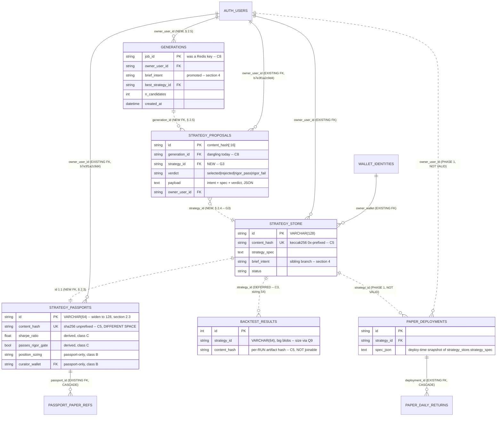

# Relations Phase 2 — passport ↔ proposal ↔ user

> **status:** plan — nothing here is built
> **owner:** Dan Browne
> **updated:** 2026-08-30
> **superseded-by:** —

Builds **on** [PR #1438](https://github.com/a-apin/archimedes/pull/1438) (schema relations
Phase 1: identity/ownership indices + gated FKs, unmerged draft). Phase 1's own § 4 says
Phase 2 is "write-path changes, not built" and names exactly one item — **G1**, persist
generation revenue. This document is the rest of Phase 2: the *relational* half, covering
the three entities Phase 1 deliberately did not touch — `strategy_passports`,
`strategy_proposals`, and the generation that produced both.

**Nothing below is implemented.** No migration in this document exists yet. Every claim
about the running code carries a file:line so the next reader can re-check it cheaply, per
CLAUDE.md's "verify your own audit claims" rule.

**Do not duplicate Phase 1.** Already covered there and not repeated here: the ten indices,
the `paper_deployments.strategy_id` widen, and the four `NOT VALID` FKs
(`linked_wallets.address`, `paper_deployments.owner_user_id` / `.strategy_id` /
`.owner_wallet`). The `NOT VALID` + separate-`VALIDATE`-revision pattern Phase 1 established
is **reused verbatim** below and is not re-argued.

---

## 0. Corrections to the brief before anything is designed

Phase 1 opened by checking its own input and found four things wrong (C1–C4). Same
discipline here. Four of the facts this plan was handed do not survive contact with the
code, and each one changes the design.

| # | As given | Verified | Effect on the plan |
|---|---|---|---|
| **C5** | "`backtest_results` links by `strategy_id`/`content_hash`" | **Only `strategy_id` links.** `backtest_results.content_hash` is a per-*run* artifact hash — `backtest_repository.py:259-260` states it outright: *"`canonical_artifact_hash` includes `run_id`, a timestamp, so `content_hash` is unique per run by construction."* It is `VARCHAR(64)`. `strategy_store.content_hash` is `VARCHAR(66)` keccak256, `0x`-prefixed (`strategy_store.py:220`). `strategy_passports.content_hash` is `VARCHAR(66)` holding a **64-char unprefixed sha256** of a different payload (`passport_loader.py:47`). `strategy_proposals.content_hash` is keccak256 of a *fourth* payload (`strategy_memory.py:25`). | **Four columns named `content_hash`, four disjoint hash spaces.** Any join on `content_hash` across these tables returns zero rows, always. § 2 adds a documentation-level guard, not a constraint. No FK is proposed on any `content_hash`. |
| **C6** | "`strategy_store`(96) and `strategy_passports`(96) are parallel rows" | Equal cardinality is not set equality, and the id columns are not the same width: `strategy_store.id` is `VARCHAR(128)` (widened in #1028, `strategy_store.py:48`), `strategy_passports.id` is `VARCHAR(64)` (`strategy_passport_record.py:49`). Id *values* do agree by construction on both paths — generated: `passport.id = record.id` (`generation_pipeline.py:1453`); curated: `main.py:178` builds the `StrategyRecord` **directly** with `id=s.id` rather than through `upsert_strategy` (which would have computed its own `content_hash[:16]` and broken the equality). | The 1:1 is real but **unproven per-row**. Run Q1 (§ 2.1) before believing it. A `strategy_passports.id → strategy_store.id` FK needs the width match first — the same widen Phase 1 did for `paper_deployments`. |
| **C7** | "6 dead 100%-NULL passport columns" | 100% NULL splits into two populations that must not share a migration. **Dead by construction** — no writer *can* ever set it (§ 3 names four, each with the line that proves it). **Empty in practice** — a live writer exists and the column is NULL only because upstream data is missing; `sharpe_ci_lower` / `sharpe_ci_upper` / `n_obs_daily` are the live candidates (`strategy_provider.py:381-387,457-459`), and prod's `daily_returns` backfill is still outstanding. | **Dropping an empty-in-practice column deletes a working feature and hides the real defect.** § 3's drop list is the *intersection* of the code-derived dead list and the measured NULL-fraction query — never the NULL fraction alone. |
| **C8** | (not stated) the generation is a durable parent | **The generation root is not in Postgres at all.** `strategy_proposals.generation_id` is the Redis job id (`generation_pipeline.py:1239`, `generation_id=job_id`), and `job_queue.py:25` sets `JOB_TTL = 3600`. One hour after a run, the job hash is gone — and with it `brief.intent`, `owner_user_id`, `n_candidates`, `cost`, and `result.best_strategy_id` (`generate_routes.py:870-892`). | `generation_id` is a **dangling id by design**, not a foreign key waiting to be declared. It cannot be FK'd to anything. § 1 treats the generation as a node that must be *created* in Postgres, and § 4 shows `brief_intent` is the first column of it. |

Two new gaps, continuing Phase 1's numbering (G1 = generation revenue, still open; G2 was
retired during Phase 1 review):

**G3 — the proposal→strategy edge is discarded at the write site, with the value in scope.**
`generation_pipeline.py:1233-1272` loops over candidates writing one `strategy_proposals`
row each. `strategy_ids[cand.candidate_id]` — the `strategy_store.id` that candidate became
— is a local variable *already used 24 lines above* (line 1214) and is **not passed to
`persist_proposal`**. The row records `extra.candidate_id` and `extra.selected`
(lines 1264-1270), which identify the winner *within the run* but resolve to no strategy
once the Redis job expires. `persist_proposal` has no `strategy_id` parameter
(`strategy_memory.py:52-66`). **Cost: the "which proposal became this strategy" question is
unanswerable for all 117 rows.** Closing it is a one-parameter writer change plus a column
— see § 2.4.

**G4 — the passport mirror's divergence is unobservable by construction.**
Three compounding facts, none of them individually wrong:
1. Both mirror writers swallow their exception — `generation_pipeline.py:1485-1486`
   (*"unified passport persist failed (non-blocking)"*) and `strategy_provider.py:558`
   (*"unified table sync failed (non-blocking)"*).
2. `passport_loader._update_record` (lines 195-229) refreshes **19** columns on a
   `force_update` hit — 18 unconditionally, plus `universe_source` only when the incoming
   passport carries one (lines 208-213 say why). `StrategyPassportRecord` has **49**
   (`SELECT` it yourself: `len(StrategyPassportRecord.__table__.columns)`).
   `total_trades`, `win_rate`,
   `calmar_ratio`, `correlation_to_spy`, `backtest_start`, `backtest_end`,
   `sharpe_ci_lower/upper`, `n_obs_daily` are written at INSERT and then **never updated
   again** — a re-graded strategy keeps its first-ever values in those columns forever.
3. Nothing anywhere compares the two tables.

So a passport row can be absent, stale, or contradictory to `strategy_store` and no signal
is produced. This is precisely the shape CLAUDE.md's fail-soft rule names: *"a fail-soft
default converts an outage into a silence, and silence is indistinguishable from working."*

---

## 1. Target entity graph

Solid = FK that exists today. Dashed = Phase 1's four `NOT VALID` FKs (in #1438, unmerged).
Dotted = **proposed in this document**. `GENERATIONS` is drawn as a new table because,
per C8, no durable row exists for it today.



Read the graph as one sentence: **a user's brief starts a generation; the generation emits
N proposals; one proposal wins and becomes a strategy; the strategy carries a passport, is
graded by backtests, and is deployed to paper.** Today three of those five arrows are not
in the database — the generation is in Redis for an hour (C8), the proposal→strategy arrow
is thrown away (G3), and the strategy→passport arrow is an unchecked convention (G4).

### 1.1 The decision: passport-as-view or passport-as-synced-table?

**Decision: `strategy_passports` stays a TABLE, and stops being a MIRROR.** Rejecting the
view is not a defence of the status quo — the mirror as it exists today is the defect (G4).
The argument, honestly both ways.

**The case for a view is strong and should be stated first.** It deletes the entire
divergence class rather than monitoring it; 96 rows makes a view free at any plausible
scale; and the columns that most often go stale (`sharpe_ratio`, `passes_rigor_gate`,
`deflated_sharpe_ratio` …) already have a superior source of truth in `backtest_results`,
which the model file itself concedes: *"the source-of-truth for backtests remains the
`backtest_results` table"* (`strategy_passport_record.py:10-11`). A view over
`strategy_store ⋈ backtest_results` cannot be stale, by construction.

**Four blockers make it wrong for Phase 2, in descending order of hardness.**

**B1 — the table is not derivable.** Nine columns have no source outside the passport
row: `position_sizing`, `rebalance_frequency`, `risk_constraints`, `risk_profiles`,
`methodology_text`, `curator_wallet`, `curator_note`, `strategy_code_path`,
`strategy_code_hash`. They are parsed from curated-strategy YAML metadata at boot
(`strategy_provider.py:408-434`) and written nowhere else. `strategy_store` has no
counterpart for any of them. A view **cannot** produce a value that exists in no table.

**B2 — a view cannot be an FK target.** `passport_paper_refs.passport_id` FKs
`strategy_passports.id ON DELETE CASCADE` (`strategy_passport_record.py:231`). Replacing
the table with a view drops that constraint and orphans the paper-reference rows — which
are the provenance chain, the thing the product's central claim rests on.

**B3 — a view is not updatable, and something updates it.**
`claim_legacy_wallet_data` issues a bulk `UPDATE` against
`StrategyPassportRecord.owner_user_id` (`wallet_routes.py:270,274-278`). Every wallet link
runs it. Making that work over a view requires `INSTEAD OF` triggers — more machinery than
the mirror it replaces.

**B4 — the cold-boot order is backwards for a store-derived view.**
`LocalStrategyProvider.__init__` calls `refresh()` (`strategy_provider.py:481`), which calls
`_sync_to_unified_table` — so on a fresh database **curated passport rows are written before
`main.py:165-195` seeds `strategy_store`**. A view over `strategy_store` would show zero
curated strategies until the seed lands, and would show *nothing at all* for any strategy
whose best-effort seed failed. That converts today's divergence into silent data loss.

**What replaces "mirror", then.** Classify all 49 passport columns and treat each class by
its own law:

| Class | What it is | Columns (representative) | Phase 2 treatment |
|---|---|---|---|
| **A — duplicated** | Also lives on `strategy_store`; the divergence surface | `id`, `generation_method`, `status`, `owner_wallet`, `owner_user_id`, `asset_universe`, `universe_source` | **Constrain, don't copy.** The 1:1 FK (§ 2.3) makes existence divergence impossible; § 2.6's detector makes value divergence loud. Column removal is Phase 3. |
| **B — passport-only** | No source anywhere else (B1) | the nine from B1, plus `methodology_hash`, `extraction_llm`, `paper_claimed_*` | **Keep as stored columns.** This is why the table survives. |
| **C — derived** | Recomputable from `backtest_results` | `sharpe_ratio`, `sortino_ratio`, `max_drawdown`, `cagr`, `win_rate`, `total_trades`, `calmar_ratio`, `correlation_to_spy`, `backtest_start/end`, `deflated_sharpe_ratio`, `dsr_p_value`, `pbo_score`, `out_of_sample_sharpe`, `passes_rigor_gate` | **Ship `v_strategy_passport_live` beside the table** (§ 2.6) — a read-only view joining `strategy_store ⋈ latest backtest_results`. Readers migrate onto it one at a time; the columns stay until the last reader is off. This is where the view idea lands, scoped to the ten columns where it is unambiguously correct. |

So the answer to "view or table" is **both, along the seam that class C already draws** —
the passport table keeps what only it knows (B), and the numbers that go stale are read
from a view that cannot go stale (C). Nothing is dropped in Phase 2; the view is additive
and the migration is a `CREATE VIEW`.

---

## 2. FK / index plan

### 2.1 Run these first — read-only, no locks, no writes

Every ALTER below is **gated on the result of the matching query**. Run them all against
prod (read replica is fine) and record the counts in the migration's docstring.

The precedent for that is **not** a Phase 1 revision — Phase 1's two revisions
(`fb8d0bae8112`, `9c2e7b5a1f4d`) are still unmerged in #1438. It is
`backend/migrations/versions/f0ab58339d55_dedupe_backtest_results_canonical_hash.py`
(issue #1347, merged, `Revises: e2b7f4c81d93`), whose docstring records *"Measured against
production 2026-08-20 (read-only query): **646 rows over 51 distinct strategies**, top
offenders 31 / 25 / 24 rows"* — a measurement of `backtest_results`, taken before that
migration deleted a single row. Copy the discipline, not the table. Phase 1's C1 stands: an
unmeasured FK is a deploy-time hard failure waiting to happen.

```sql
-- Q1  Passport rows with no strategy_store parent.  GATES: § 2.3 FK.
--     Expected 0 if C6's 1:1 holds. Any nonzero → the FK ships NOT VALID and stays NOT VALID.
SELECT COUNT(*) AS orphan_passports
  FROM strategy_passports sp
  LEFT JOIN strategy_store ss ON sp.id = ss.id
 WHERE ss.id IS NULL;

-- Q2  The other direction: strategies with no passport. NOT an FK violation
--     (the FK is one-way) — this is the G4 divergence measurement.
SELECT COUNT(*) AS strategies_without_passport
  FROM strategy_store ss
  LEFT JOIN strategy_passports sp ON ss.id = sp.id
 WHERE sp.id IS NULL;

-- Q3  Value divergence on the class-A columns, per row. GATES: § 2.6 detector thresholds.
SELECT ss.id,
       ss.status        AS store_status,   sp.status        AS passport_status,
       ss.owner_user_id AS store_user,     sp.owner_user_id AS passport_user,
       ss.owner_wallet  AS store_wallet,   sp.owner_wallet  AS passport_wallet
  FROM strategy_store ss
  JOIN strategy_passports sp ON ss.id = sp.id
 WHERE ss.status        IS DISTINCT FROM sp.status
    OR ss.owner_user_id IS DISTINCT FROM sp.owner_user_id
    OR ss.owner_wallet  IS DISTINCT FROM sp.owner_wallet;

-- Q4  Any passport id that would not survive the widen check / any id > 64 chars
--     in strategy_store that a VARCHAR(64) child could never reference.
SELECT COUNT(*) AS oversized_store_ids
  FROM strategy_store WHERE LENGTH(id) > 64;

-- Q5  NULL-owner proposals, split by whether a wallet is present. GATES: § 2.7 backfill.
SELECT COUNT(*) FILTER (WHERE owner_user_id IS NULL AND owner_wallet IS NOT NULL) AS wallet_only,
       COUNT(*) FILTER (WHERE owner_user_id IS NULL AND owner_wallet IS NULL)     AS fully_anonymous,
       COUNT(*) FILTER (WHERE owner_user_id IS NOT NULL)                          AS owned
  FROM strategy_proposals;

-- Q6  Of the wallet-only proposals, how many wallets are actually linked to an account?
--     This is the ONLY population § 2.7 can honestly backfill.
SELECT COUNT(DISTINCT sp.owner_wallet) AS claimable_wallets,
       COUNT(*)                        AS claimable_rows
  FROM strategy_proposals sp
  JOIN linked_wallets lw ON LOWER(sp.owner_wallet) = LOWER(lw.address)
 WHERE sp.owner_user_id IS NULL;

-- Q7  Column NULL fractions on strategy_passports. GATES: § 3's drop list.
--     Reproduces the "6 dead columns" figure; § 3 intersects it with the code-derived list.
SELECT COUNT(*) AS n,
       COUNT(on_chain_registration_tx)    AS nn_onchain_tx,
       COUNT(on_chain_registration_block) AS nn_onchain_block,
       COUNT(extraction_prompt_hash)      AS nn_prompt_hash,
       COUNT(paper_claim_blended_sharpe)  AS nn_blended_sharpe,
       COUNT(sharpe_ci_lower)             AS nn_ci_lower,
       COUNT(sharpe_ci_upper)             AS nn_ci_upper,
       COUNT(n_obs_daily)                 AS nn_n_obs,
       COUNT(kelly_fraction)              AS nn_kelly,
       COUNT(curator_wallet)              AS nn_curator_wallet,
       COUNT(curator_note)                AS nn_curator_note,
       COUNT(methodology_text)            AS nn_methodology_text,
       COUNT(strategy_code_hash)          AS nn_code_hash,
       COUNT(universe_source)             AS nn_universe_source
  FROM strategy_passports;

-- Q8  backtest_results rows pointing at no strategy. Informational only — § 2.8
--     explains why no FK is proposed on this table in Phase 2.
SELECT COUNT(*) AS orphan_backtests
  FROM backtest_results br
  LEFT JOIN strategy_store ss ON br.strategy_id = ss.id
 WHERE ss.id IS NULL;

-- Q9  How big backtest_results actually is. GATES: § 5.1's sizing row and § 2.8's
--     deferral. Neither the row count nor the on-disk size is derivable from this
--     tree — see the note under § 5.1 for why the figure that used to sit there
--     was not a measurement. total_ includes the TOAST relation, which is where the
--     JSON payloads live; heap alone would understate it by most of the table.
SELECT COUNT(*)                                                   AS n_rows,
       pg_size_pretty(pg_total_relation_size('backtest_results')) AS total_size,
       pg_size_pretty(pg_relation_size('backtest_results'))       AS heap_only
  FROM backtest_results;
```

### 2.2 Widen `strategy_passports.id` to match its future parent

Prerequisite for § 2.3, and the same move Phase 1 made for `paper_deployments.strategy_id`
— including the same honesty about the downgrade.

```sql
ALTER TABLE strategy_passports ALTER COLUMN id TYPE VARCHAR(128);
ALTER TABLE passport_paper_refs ALTER COLUMN passport_id TYPE VARCHAR(128);
```

Both are `character varying` widens: metadata-only in Postgres, no table rewrite, no
`ACCESS EXCLUSIVE` held for longer than the catalog update. `passport_paper_refs.passport_id`
**must** move in the same revision — it FKs `strategy_passports.id`, and Postgres refuses to
leave a narrower child pointing at a widened parent through an existing constraint. The
downgrade is conditionally safe only, guarded by the same `_fail_if_narrow_would_truncate`
helper Phase 1 introduced in `fb8d0bae8112`; **reuse it, do not re-implement it.**
Current values are 32 chars (curated, `strategy_provider.py:139`) or 16 (generated,
`strategy_store.py:294`), so this is headroom.

### 2.3 The 1:1 FK — `strategy_passports.id → strategy_store.id`

The single most valuable constraint in this document: it makes G4's *existence* half
impossible.

```sql
ALTER TABLE strategy_passports
  ADD CONSTRAINT fk_strategy_passports_id_strategy_store
  FOREIGN KEY (id) REFERENCES strategy_store (id) NOT VALID;
```

Validated in a separate revision, gated on Q1 returning 0 — Phase 1's exact pattern.

**This FK cannot ship before the writer change in § 2.3.1.** `NOT VALID` skips historical
rows; it does **not** skip future writes. Per B4, on a cold database the curated passport
sync runs *before* `main.py` seeds `strategy_store`, so this constraint would abort every
curated passport insert on first boot — turning a working cold start into a failed one.
Adding the FK without fixing the order is the exact class of mistake Phase 1's `NOT VALID`
design exists to prevent, arriving through write ordering instead of through historical data.

**§ 2.3.1 — the writer change that must land first.** In `main.py`'s startup sequence,
seed `strategy_store` from `provider.list_strategies()` **before** the provider's
`_sync_to_unified_table` writes passports. Two ways, in preference order:
1. Move `_sync_to_unified_table` out of `LocalStrategyProvider.refresh()`
   (`strategy_provider.py:531-533`) and call it explicitly from `main.py` after the seed
   block. The one-time `_synced_to_unified` flag already makes it a startup-only concern;
   the call site is the only thing moving.
2. If (1) is too invasive, have `ingest_passport` upsert the `strategy_store` parent first.
   Worse — it puts a store write inside the passport loader — but it is order-independent.

Whichever is chosen, the acceptance test is a **cold-boot test against an empty database**
with the FK present: `init_db()` → `default_provider()` → startup seed → assert
`SELECT COUNT(*) FROM strategy_passports` equals the curated count and no warning was
logged. Without that test the fix is unverified, because the failure only appears on an
empty DB and every developer's DB is warm.

### 2.4 Close G3 — the proposal→strategy edge

```sql
ALTER TABLE strategy_proposals ADD COLUMN strategy_id VARCHAR(128);
CREATE INDEX ix_strategy_proposals_strategy_id ON strategy_proposals (strategy_id);
ALTER TABLE strategy_proposals
  ADD CONSTRAINT fk_strategy_proposals_strategy_id
  FOREIGN KEY (strategy_id) REFERENCES strategy_store (id) ON DELETE SET NULL NOT VALID;
```

Nullable, and it stays nullable permanently: a proposal that was rejected before any
`strategy_store` row was created legitimately has no strategy. `ON DELETE SET NULL` matches
the five sibling ownership FKs from `b7e3f1a2c9d4`.

Writer change, `strategy_memory.persist_proposal`: add a keyword-only
`strategy_id: str | None = None` and set it on both the insert and the dedup-backfill
branch (`strategy_memory.py:118-126`), following the never-overwrite-an-existing-value rule
already used there for ownership. Call site: pass
`strategy_ids.get(cand.candidate_id)` at `generation_pipeline.py:1238` — the dict is already
in scope (used at line 1216).

**No backfill is possible for the existing 117 rows.** The winner→strategy mapping lived in
the Redis job record, which expired (C8). Leave them NULL — an honest unknown, never a
guessed join on `strategy_name`, which is not unique and would fabricate provenance. State
this in the migration docstring so the next reader does not "fix" it.

### 2.5 Create the generation node (closes C8, and hosts § 4)

```sql
CREATE TABLE generations (
    job_id            VARCHAR(64)  PRIMARY KEY,
    owner_user_id     VARCHAR(64)  REFERENCES auth_users (id) ON DELETE SET NULL,
    owner_wallet      VARCHAR(42)  REFERENCES wallet_identities (wallet_address),
    brief_intent      TEXT         NOT NULL DEFAULT '',
    brief_json        TEXT,
    n_candidates      INTEGER      NOT NULL DEFAULT 1,
    best_strategy_id  VARCHAR(128) REFERENCES strategy_store (id) ON DELETE SET NULL,
    state             VARCHAR(16)  NOT NULL DEFAULT 'queued',
    cost_json         TEXT,
    created_at        TIMESTAMPTZ  NOT NULL DEFAULT now(),
    updated_at        TIMESTAMPTZ  NOT NULL DEFAULT now()
);
CREATE INDEX ix_generations_owner_user_id ON generations (owner_user_id);
CREATE INDEX ix_generations_created_at    ON generations (created_at);

ALTER TABLE strategy_proposals
  ADD CONSTRAINT fk_strategy_proposals_generation_id
  FOREIGN KEY (generation_id) REFERENCES generations (job_id) NOT VALID;
```

Redis stays the *runtime* store — heartbeats, event log, the 15-minute reconnection window
(`job_queue.py:26`) — and Postgres becomes the *durable* record, written once on the
terminal path where `result.cost` is already snapshotted. This is the same
runtime-vs-durable split `paper_daily_returns` already uses, and it is what makes `/api/jobs`
survive past an hour without changing its wire shape: `_job_summary`
(`generate_routes.py:870-892`) reads Redis first and falls back to `generations`.

`fk_strategy_proposals_generation_id` stays **NOT VALID forever** on the existing 117 rows —
their parents are gone and cannot be reconstructed. It enforces every future write, which is
the whole point; validating it is not a goal. Say so in the docstring so nobody later
"finishes the job" by deleting the historical proposals to make a `VALIDATE` succeed.

### 2.6 Make G4's value half loud

Two additive pieces, no writer change:

```sql
CREATE VIEW v_strategy_passport_live AS
SELECT ss.id,
       ss.status,
       ss.owner_user_id,
       ss.owner_wallet,
       b.sharpe_ratio, b.sortino_ratio, b.max_drawdown, b.cagr, b.win_rate,
       b.total_trades, b.calmar_ratio, b.correlation_to_spy,
       b.backtest_start, b.backtest_end,
       b.deflated_sharpe_ratio, b.dsr_p_value, b.pbo_score, b.out_of_sample_sharpe
  FROM strategy_store ss
  LEFT JOIN LATERAL (
        SELECT * FROM backtest_results br
         WHERE br.strategy_id = ss.id
         ORDER BY br.created_at DESC, br.id DESC
         LIMIT 1
  ) b ON TRUE;
```

The `LATERAL … LIMIT 1` is the same "latest per strategy" shape
`backtest_repository.latest_backtests_by_strategy` already resolves in the database, and for
the same reason stated there: the JSON payloads must not be dragged through the client
buffer. **Select no `*_json` column from `backtest_results` in this view, ever** — at
~425 KB/row that is the difference between a fast view and an OOM (`backtest_repository.py:254-263`
records the measured 0.58 MB-per-row staircase that pushed the 2026-08-19 backend past its
task budget).

Second piece: a `/health` field or a scheduled check that runs Q2 and Q3 and reports the
counts. A nonzero divergence must produce a visible number, not a log line — CLAUDE.md's
fail-soft rule again. This is the smallest thing that turns the two swallowed `except`
blocks from invisible into merely non-blocking.

**Do not** change the two swallowed handlers to raise as part of this. They are correct
fail-soft for an optional mirror; the defect was never that they swallow, it was that
nothing else looks.

### 2.7 Backfill strategy for the NULL-owner proposals

Q5 splits the 117 rows into three populations, and each gets a different answer. This is
the part of the plan most likely to be done wrong by reflex.

| Population | Rule | Rationale |
|---|---|---|
| `owner_user_id` present | untouched | already canonical |
| `owner_user_id` NULL, `owner_wallet` set **and** in `linked_wallets` (Q6) | **claimable — but not by a migration** | The correct mechanism already exists and already runs: `claim_legacy_wallet_data` (`wallet_routes.py:236-278`) stamps `owner_user_id` onto exactly this population, filtered on `owner_user_id IS NULL`, and `StrategyProposal` is already in its default model tuple (line 271). These rows convert **the next time that wallet is linked or re-verified**, with a fresh signature as the authorization. |
| `owner_user_id` NULL, `owner_wallet` NULL | **stays NULL, permanently** | Nothing identifies the author. Any assignment fabricates ownership of a row containing another person's private brief. |

**The recommendation is therefore: write no backfill UPDATE at all.** The migration adds no
`UPDATE strategy_proposals SET owner_user_id = …`. Three reasons, and the third is the one
that matters:

1. It would duplicate `claim_legacy_wallet_data`, giving two code paths for one invariant.
2. A migration cannot verify signature control; `claim_legacy_wallet_data` runs behind a
   proof of it.
3. **The read path is already safe without any backfill.** `proposals_routes.py:7-13` states
   it: the owner-scoped read filters on an exact non-NULL match, so *"unowned legacy rows are
   returned to no one."* An unbackfilled row is invisible, not leaked. There is no privacy
   pressure to backfill — the pressure runs the other way, since a wrong backfill would
   *expose* a private brief to the wrong account. Leaving them NULL is the fail-closed
   direction.

What the migration *should* do is make the population visible: log the Q5 counts in the
revision docstring, and open an issue if `fully_anonymous` is large enough to matter for the
episodic-memory story. If a bulk claim is ever genuinely wanted, it belongs behind an
authenticated "claim my history" endpoint that calls `claim_legacy_wallet_data`, not in DDL.

### 2.8 Explicitly not proposed in Phase 2

- **`backtest_results.strategy_id → strategy_store.id`.** Phase 1's C3 deferred it because
  both writers establishing the id-space equality are best-effort. That reasoning is
  unchanged, and § 1's B4 finding *strengthens* it. Sizing (S4) is the second reason: this
  is the one table in the plan whose `VALIDATE` scan is not free — how un-free is Q9's
  answer, not a number quoted here (§ 5.1). Run Q8 and Q9 to measure; do not add the
  constraint in Phase 2.
- **Any FK or join on `content_hash`.** See C5 — four columns, four hash spaces. The
  deliverable here is a comment on each of the four columns naming its algorithm, prefix
  convention, and payload, so the next reader cannot mistake them for one key.
- **Dropping class-A columns from `strategy_passports`.** Phase 3, after § 2.6's view has
  readers.
- **`generation_payments` (G1).** Phase 1's § 4 owns it; it is revenue, not relations. It
  should ride § 2.5's migration slot only if `generations.job_id` turns out to be its natural
  parent — decide when G1 is specced, not here.

---

## 3. Dead columns: the drop list and its migration

**The rule (from C7): a column is dropped only if it is on BOTH lists.**

**List 1 — dead by construction** (no writer can set it; each line is the proof):

| Column | Proof it can never be non-NULL |
|---|---|
| `on_chain_registration_block` | Not a parameter of the `StrategyPassportRecord(...)` constructor in `passport_loader.py:122-181`, and not assigned in `_update_record`. **No writer exists at all.** The name is *not* rare in the tree, though — `grep -rn on_chain_registration_block --include='*.py' .` returns **eleven lines across six files** (twelve raw matches; `strategy_store.py:159` names it twice). None of them is a writer of *this* column, and the list is worth reading before the drop: `strategy_passport_record.py:100` is the column definition itself; `af9c6a9376e4_baseline_schema.py:300` is this table's own baseline DDL. The `strategy_store` namesake — a **different table**, out of scope for § 3.1 — accounts for `strategy_store.py:98,159`, `db.py:174`, `af9c6a9376e4_baseline_schema.py:375`, and `test_strategy_publisher.py:296,301,317,321` (which asserts on `StrategyRecord`, and must therefore keep passing untouched — if § 3.1's drop breaks it, the drop hit the wrong table). The one occurrence the drop **must** also remove: `models/strategy.py:138`, the `on_chain_registration_block: int \| None = None` field on the `StrategyPassport` **dataclass** — the in-memory shape the loader reads from. Leave it and the dataclass keeps a field no column can persist. |
| `on_chain_registration_tx` | Written from `passport.on_chain_registration_tx` (`passport_loader.py:152`). Curated passes the literal `None` (`strategy_provider.py:433`); the generated path's `StrategyPassport(...)` (`generation_pipeline.py:1452-1469`) never sets it, so it takes the dataclass default. Both producers are exhaustive. |
| `extraction_prompt_hash` | Same shape: `passport_loader.py:142` reads it; `strategy_provider.py:427` passes the literal `None`; the generated path never sets it. |
| `paper_claim_blended_sharpe` | `passport_loader.py:156` reads it; **neither** producer sets it — absent from `strategy_provider.py`'s `Strategy(...)` construction and from `generation_pipeline.py`'s `StrategyPassport(...)`. Default `None` (`models/strategy.py:147`). |

**List 2 — measured 100% NULL:** the output of Q7. Not reproduced here, because a number
copied into a doc is exactly the staleness CLAUDE.md forbids. Run it.

**The intersection is the drop list.** If Q7 reports six 100%-NULL columns, the two beyond
List 1 are almost certainly from the live-writer set — `sharpe_ci_lower`, `sharpe_ci_upper`,
`n_obs_daily` are the leading candidates (`strategy_provider.py:381-387` computes them; the
generated path leaves them NULL; `_update_record` never refreshes them). **Those get an
issue, not a `DROP COLUMN`.** They are the visible symptom of the outstanding prod
`daily_returns` backfill; dropping them deletes the evidence and the feature. Same test for
`curator_wallet` / `curator_note` / `methodology_text` — all have live curated-YAML writers.

### 3.1 The migration

```sql
-- Revision: drop dead passport columns. GATED on Q7 confirming 0 non-NULL for each.
-- Only columns on BOTH List 1 (code-derived) and List 2 (measured) appear here.
ALTER TABLE strategy_passports DROP COLUMN on_chain_registration_block;
ALTER TABLE strategy_passports DROP COLUMN on_chain_registration_tx;
ALTER TABLE strategy_passports DROP COLUMN extraction_prompt_hash;
ALTER TABLE strategy_passports DROP COLUMN paper_claim_blended_sharpe;
```

Mechanics that are easy to get wrong:

- **`DROP COLUMN` is destructive and its `downgrade()` is a lie.** Re-adding the column
  restores the shape, never the data. Since Q7 gates on 0 non-NULL values, "no data" is
  *provably* what is lost — say that in the docstring rather than implying reversibility.
- **The revision must also drop the model attributes and every reader in the same PR**, or
  `create_all()` (the SQLite path, C2) and Alembic diverge and `test_alembic_migrations.py`'s
  parity gate fails. Readers to remove: `passport_loader.py:142,152,156`;
  `strategies_routes.py:158,160,1990,1992`; `api/schemas.py:199,255`;
  `strategy_provider.py:427,433`; the four `StrategyPassport` dataclass fields, which are
  `models/strategy.py:119` (`extraction_prompt_hash`), `:137` (`on_chain_registration_tx`),
  `:138` (`on_chain_registration_block`), `:147` (`paper_claim_blended_sharpe`); and the
  `Strategy`/`StrategyPassport` constructor arguments that pass literal `None`.
  **Do not touch the `strategy_store` namesakes** — `strategy_store.py:98,159`, `db.py:174`,
  `af9c6a9376e4_baseline_schema.py:375`, `test_strategy_publisher.py:296-321`. That is a
  different table with its own on-chain columns, and § 3 says nothing about it. If
  `test_strategy_publisher.py` goes red, the drop went one table too far.
- **`strategies_routes.py` returns these in an API response model.** Removing a field from a
  Pydantic response is a wire-shape change. Both are always `null` today, so no consumer can
  depend on a value — but a UI destructuring `passport.on_chain_registration_tx` will now get
  `undefined` rather than `null`. Grep `ui/src` before the drop and note the result in the PR.
- **Cheap on Postgres.** `DROP COLUMN` marks the attribute dropped in the catalog; it does
  not rewrite the heap. Milliseconds at 96 rows, and effectively free at any size.
- **Squeeze in the `content_hash` comments here** (§ 2.8) — same table, zero extra risk:
  `COMMENT ON COLUMN strategy_passports.content_hash IS 'sha256 hex, UNPREFIXED, of
  methodology+universe+paper_ids (passport_loader._compute_content_hash). NOT the same space
  as strategy_store.content_hash (keccak256, 0x-prefixed) or backtest_results.content_hash
  (per-run artifact hash). Never join across them.'`

---

## 4. How `brief_intent` promotion fits

A sibling branch adds `strategy_store.brief_intent`. It fits cleanly, and it also creates
one hazard worth naming before it lands.

**The value already exists in the database, twice-removed.** `brief.intent` is written into
`strategy_proposals.payload` as a JSON key by `persist_proposal`
(`strategy_memory.py:93-100`), once for *every candidate in the run* — so N proposal rows
carry N identical copies of one user's brief. It is also on the Redis job record, where
`_job_summary` reads it as `brief_intent` (`generate_routes.py:883`), and that copy dies at
`JOB_TTL` (C8).

**So the promotion is the third copy, and it is the right one to keep.** It is the only copy
that is (a) durable, (b) queryable without JSON extraction, and (c) attached to the artifact
the user actually keeps. Nothing here argues against the sibling branch.

**The hazard is that three copies with no stated authority is how divergence starts** —
literally the G4 pattern, one table over. The plan:

1. **Name the authority in the column comment.** Once `generations` exists (§ 2.5),
   `generations.brief_intent` is the source of truth: one row per brief, which is what a
   brief is. `strategy_store.brief_intent` is a denormalized convenience for the strategy
   detail page.
2. **The proposal payload copy stays as-is.** It is inside a content-hashed blob
   (`_canonicalize_payload` at `strategy_memory.py:28-49` hashes `intent` into the row's
   identity) — rewriting it would change `content_hash` and break dedup. It is an immutable
   episodic record, correctly.
3. **Sequencing:** the sibling branch ships first and independently — it needs nothing from
   this document. When § 2.5 lands, `generations.brief_intent` is populated from the same
   `brief.intent` at the same terminal-path write, and `strategy_store.brief_intent`'s
   comment is updated to point at it. No data moves; no migration depends on the other.
4. **One thing to check in the sibling branch before it merges:** whether `brief_intent` is
   written on the `upsert_strategy` **dedup-hit** branch (`strategy_store.py:261-291`). Two
   users submitting semantically identical briefs produce the same `content_hash` and land on
   one row. Follow the established rule there — backfill onto a row that lacks one, never
   overwrite — so user A's brief cannot be replaced by user B's. Getting this wrong writes
   one user's private text onto another user's visible strategy. Worth an explicit test.

---

## 5. Sizing and ordering

### 5.1 What each table costs to touch

| Table | Rows | Size | Cost of an ALTER | Cost of a `VALIDATE` |
|---|---:|---:|---|---|
| `strategy_store` | 96 | trivial | free | free |
| `strategy_passports` | 96 | trivial | free (widen = catalog only; drop = catalog only) | free |
| `strategy_proposals` | 117 | small (payload JSON) | free | free — *if* the parent exists (§ 2.5 says it will not, by design) |
| `paper_deployments` | small | trivial | Phase 1 | Phase 1 |
| `backtest_results` | **run Q9** | **run Q9** — per-*row* weight is tree-derivable and is the point: ~489 KB `artifact_json` + ~108 KB `equity_curve_json`, measured at 0.58 MB of peak RSS per persisted row (`backtest_repository.py:258-263`) | a `VARCHAR` widen is catalog-only and still cheap | **a full seq scan of the entire table, blobs included.** This is the only expensive operation anywhere in the plan. |

The whole passport/proposal/generation core is **~300 rows**. Every constraint in §§ 2.2–2.7
is effectively instantaneous; the risk in this plan is entirely about *write ordering and
correctness*, not about lock duration. `backtest_results` is the sole exception and is
deliberately deferred (§ 2.8).

**Why that row says "run Q9" instead of a number.** An earlier draft of this table carried
"**14,857** rows / **6.3 GB**". Neither figure is derivable from this tree, and neither is
recorded anywhere else either — `14,857` appears in no file in this repo or the private docs
repo other than this document. The nearest genuine measurement is the private docs repo's
`operations/aws-cost-baseline-2026-08-30.md`, and it **corrects** the premise rather than
confirming it: its § *"The 6.3 GB `backtest_results` premise needs correcting"* records
Aurora `VolumeBytesUsed` for the **whole database** at **2.25–4.43 GB** on 2026-08-30
(growing ~0.5 GB/day) against a `Aurora:StorageUsage` bill of $0.19/mo — so "6.3 GB of
`backtest_results`" cannot be a measured table size. What survives is the shape of the
argument, and it survives intact: the blobs are real, they are why § 2.8 defers the FK, and
per that cost baseline the money they cost is **read amplification, not storage**. So the
number goes back to being a query, which is this document's own § 3 rule applied to itself.

### 5.2 Ordering — and the two dependencies that must not be violated

```
D1: § 2.3.1 (cold-boot write order fix)  MUST PRECEDE  § 2.3 (the 1:1 FK)
    Reason: B4. NOT VALID does not exempt future writes; the FK would break cold boot.

D2: § 2.2 (widen id to VARCHAR(128))     MUST PRECEDE  § 2.3 (the 1:1 FK)
    Reason: C6. VARCHAR(64) child cannot reference a VARCHAR(128) parent.
```

| Week | Ships | Why it can ship then | Risk |
|---|---|---|---|
| **W1** | Q1–Q9 against prod (read-only). § 3's `DROP COLUMN` migration + model/reader/schema removal. The four `COMMENT ON COLUMN` statements from § 2.8. | Zero dependencies. Zero locks worth naming. The audit output is what unblocks every later week. | **Low.** Only real risk is the API wire-shape change (§ 3.1) — grep `ui/src` first. |
| **W2** | § 2.4's `strategy_id` column + index + `persist_proposal` parameter + call site (G3). § 2.2's widen. | Additive column on a 117-row table; the widen is catalog-only. Both are FK-free, so neither can break a write path. | **Low.** The writer change is one keyword argument threaded from a value already in scope. |
| **W3** | § 2.3.1's cold-boot order fix **with its empty-DB test**, then § 2.3's `NOT VALID` FK, then § 2.4's FK. Validate revision for both, gated on Q1. | D1 and D2 are both satisfied. This is the week the entity graph actually becomes a graph. | **Medium — the highest in the plan.** The order fix touches startup. It must be verified on an empty database; a warm DB hides the failure entirely. |
| **W4** | § 2.5's `generations` table + the durable terminal-path write + the `_job_summary` Redis-then-Postgres fallback + the permanently-`NOT VALID` `generation_id` FK. | Needs W2/W3's `strategy_store` FK target to exist for `best_strategy_id`. | **Medium.** New write on a user-facing path; must stay non-blocking, same as every other write in that pipeline. |
| **W5+** | § 2.6's `v_strategy_passport_live` + the Q2/Q3 divergence check. Then, separately: G1 (`generation_payments`), the `backtest_results` FK if Q8 comes back 0 and Q9 says the scan is affordable, class-A column removal. | The view is additive and depends on nothing; it is W5 only because it is the least urgent. | **Low** for the view. The class-A removal is Phase 3 and needs its own plan. |

**If only one week is available, do W1 and W2.** W1 removes four columns that can never hold
data and documents the four-hash trap that will otherwise cost someone a day. W2 closes G3 —
recovering the proposal→strategy edge, which is the one piece of provenance currently being
thrown away *while the value sits in a local variable*. Both are additive, neither can break
a running deploy, and together they make W3's higher-risk work reviewable.

**If W3 slips, do not ship § 2.3's FK "just NOT VALID to be safe."** That is the specific
misreading this plan exists to prevent: `NOT VALID` protects you from *historical* rows, not
from the *next* cold boot.
