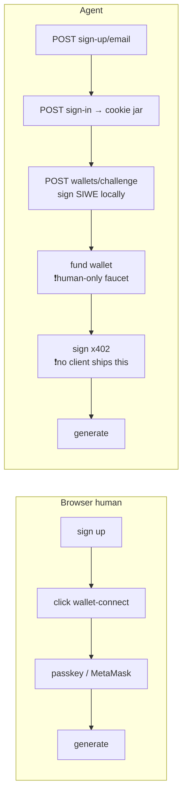

# Agent-native onboarding — account, wallet, and payment for programmatic callers

> **status:** draft
> **owner:** Dan Browne
> **updated:** 2026-08-31
> **superseded-by:** —

`status: draft` is deliberate and load-bearing. Everything in §§ 1–5 is verified against
the running system and the tree, and can be trusted. §§ 6–7 are **open questions that only
the owner can close** — six of them, in a table, in the house style of
[PR #1432](https://github.com/aprin-labs/archimedes/pull/1432)'s "What you have to decide".
The doc goes `current` when those rows have answers, not before. A doc that quietly
answered them itself would be the exact cross-issue drift it exists to prevent.

**Where this sits, and why here.** [`CONVENTIONS.md`](../CONVENTIONS.md) § 1 routes on
first match: this is not an ADR (nothing is closed off yet — that is the point), and it is
not a roadmap for `plans/`. It is the frozen description of an interface others build
against — the agent-facing onboarding contract — with its undecided seams named rather
than papered over, so `specs/` is the row that fits. When a decision below is settled and
closes off alternatives, **that** decision earns an ADR of its own; this doc links to it
and stops asserting the question.

---

## 1. What this is, and what it is not

This doc covers **how a non-browser caller gets from nothing to a paid generation**, and
the decisions that are still open on that path. It does **not** re-derive the journey.

| If you want… | Read |
| --- | --- |
| The runnable recipe, one `curl` per step | `docs/agent-quickstart.md` ([link](../agent-quickstart.md)) |
| The full surface — wallet handshake, vault, marketplace, harness | `docs/agent-api.md` ([link](../agent-api.md)) |
| Machine discovery of the above | `GET /api/agent/manifest`, `/.well-known/agent.json`, `/llms.txt` |
| **What is undecided about the agent path, and who decides** | this doc, §§ 6–7 |

Those two pages are the source of truth for *how*. Nothing here restates their steps; where
this doc names a step it names the **delta** — the place the agent path behaves differently
from the browser path, or the place a decision is missing.

## 2. The four caller shapes

"Agent user" is not one thing. Four shapes exist or are proposed, and they do **not** share
an onboarding story:

| Shape | What it is today | Onboarding path |
| --- | --- | --- |
| **Raw HTTP** | `curl` / `httpx` / any client | The full quickstart. Works end to end. |
| **Agent skill** | [`skills/`](../../skills/README.md) — five `SKILL.md` files, *documentation* that teaches an LLM agent the HTTP surface. No code, no runtime. | Identical to raw HTTP; the skill is a map, not a client. |
| **CLI** | [`cli/`](../../cli/README.md) `archimedes` 0.1.0 — `login`, `meter`, `verify`, `manifest` implemented; `backtest` and `verify --local` exit `NOT_IMPLEMENTED` (3). | **Stops before the money.** See § 4. |
| **MCP server** | **Does not exist in this repo.** | Undecided — decision **D2**. |

**On MCP: is it a product surface at all, or is the skills-plus-CLI pair the answer? That
is an open question and this doc does not answer it.** Grepping `docs/`, `cli/`, `skills/`,
`backend/`, `ui/src/`, and `scripts/` for `mcp` returns only three unrelated kinds of hit:
Safari MCP as a *tool the team drives a browser with*, OpenWiki's
`openwiki mcp --host claude` mode
([`decisions/tooling-adoptions-2026-08.md`](../decisions/tooling-adoptions-2026-08.md)),
and [`anti-features.md`](../anti-features.md)'s "NOT building: a custom agent framework"
entry, which mentions `fastmcp` only as an off-the-shelf option *if* an MCP-style tool
layer is ever needed. There is no MCP server, no MCP dependency, and no commitment to
build one. [`architectural-principles.md`](../architectural-principles.md) calls
"MCP-native" part of what makes the pitch credible — that is a *pitch aspiration*, not a
shipped surface, and the gap between the two is precisely what D2 asks the owner to close.

## 3. The surface that exists today

Every row verified 2026-08-31 against the tree, and — where marked **live** — against
`https://archimedes-arc.com`.

| Need | Endpoint / artifact | Backed by | Status |
| --- | --- | --- | --- |
| Discovery | `GET /api/agent/manifest` | [`agent_manifest_routes.py`](../../backend/archimedes/api/agent_manifest_routes.py) | **live** |
| Price, before holding a session | `GET /api/generate/quote` | [`generation_payment.py`](../../backend/archimedes/services/generation_payment.py) `quote()` | **live** |
| Account creation | `POST /api/auth/sign-up/email` | Better Auth sidecar, [`auth/auth.js`](../../auth/auth.js) | **live** |
| Session | `POST /api/auth/sign-in/email` → `better-auth.session_token` cookie, 7 days (`auth.js:254`) | same | **live** |
| Wallet link | `POST /api/wallets/challenge` → `/verify`, EIP-4361, `provider: "headless"` for API callers | [`wallet_routes.py`](../../backend/archimedes/api/wallet_routes.py) | **live** |
| Quota + price readback | `GET /api/account/usage` | [`account_usage_routes.py`](../../backend/archimedes/api/account_usage_routes.py) | **live** |
| Payment | 402 + `PAYMENT-REQUIRED` header → sign x402 → retry with `Payment-Signature` | [`generation_payment.py`](../../backend/archimedes/services/generation_payment.py) | **live** |
| Agent identity on-chain | ERC-8004 | `erc8004` block, same file as discovery | **`registration_pending`** |

**The live quote, read today** — not transcribed from the code defaults, which say the
opposite:

```console
$ curl -sS https://archimedes-arc.com/api/generate/quote
{"payment_required":true,"pricing_model":"flat_v1","price":"$2.000000","asset":"USDC",
 "chain":"arcTestnet","recipient":"0xffa7abba5f17cb8471ebf150bf808bd6fb8856c1",
 "dry_run":false,"halted":false,"how":"…"}
```

**ERC-8004 is not live and this doc does not claim it is.** `GET /api/agent/manifest`
today returns `"status": "registration_pending"`, `"agentId": null`, `"tokenURI": null`,
and a `note` saying in as many words that *publishing a spec-typed registration file is not
the same as being registered*. An agent must not treat Archimedes as a registered, reputed,
or validated ERC-8004 counterparty, and nothing in the onboarding design below depends on
it. Registration is tracked in
[#1527](https://github.com/aprin-labs/archimedes/issues/1527).

## 4. Where the agent path diverges from the browser path

Six deltas. Each is a real difference in what the caller must do, not a restatement of the
quickstart.



| # | Delta | Detail |
| --- | --- | --- |
| **1** | **No interactive wallet-connect** | The browser has a wallet-connect modal; an API caller has a private key and `provider: "headless"`. The other three providers (`metamask`, `browser`, `circle`) name browser software a script does not have, and recording one logs a fact that is not true — see `docs/agent-api.md` § *Optional EIP-4361 wallet link*. |
| **2** | **The faucet is human-only** | Arc testnet USDC comes from <https://faucet.circle.com/>, which is captcha'd. `generate_routes.py:463` says so in a code comment; [#1294](https://github.com/aprin-labs/archimedes/issues/1294) tracks it. An agent that links an empty wallet clears the `409` and lands on a `402` it cannot pay. **This is the hard stop on the agent path, and no amount of API design removes it.** |
| **3** | **Email verification is a latent break** | `EMAIL_VERIFICATION_ENFORCED` is `"false"` in the deployed task definition (`infra/ecs.tf:716`), so sign-in works unverified today. `auth/auth.js:448` records that it *"flips on once SES production access clears."* **An agent cannot click a link in an inbox.** Flipping that flag with no agent-side story silently ends the agent path. |
| **4** | **No credential that is not a cookie** | There is no bearer token, no API key, no PAT for external callers. `require_current_user` reads the `better-auth.session_token` cookie and only that. `X-Internal-Agent-Key` ([`auth_guard.py:37`](../../backend/archimedes/api/auth_guard.py)) is for *our own* runners, fails closed when the env var is unset, and is not an external-agent credential. The CLI's answer is a `0600` file at `~/.config/archimedes/session.json`; every other caller re-implements a cookie jar. |
| **5** | **The CLI stops before the money** | `archimedes` 0.1.0 has no `wallets`, no `generate`, and no payment command — grep `cli/src/archimedes_cli/cli.py` for `wallets\|generate\|Payment-Signature` returns nothing. It can `login`, read the meter, and run `verify`; **it cannot complete a generation on production.** It is also not on PyPI (`https://pypi.org/pypi/archimedes-cli/json` → HTTP 404, checked 2026-08-31); install is `pip install -e ./cli`. |
| **6** | **Nothing signs x402 for the caller** | The 402 carries machine-readable requirements, and the caller signs an EIP-3009 authorization itself. No first-party client in this repo does that — `skills/x402-payment/SKILL.md` documents the *marketplace* in-process rail, explicitly "not to gate a public API route." The agent brings its own signer, plus an `Idempotency-Key`, because a naive retry signs a fresh authorization and pays twice. |

Deltas 2, 5 and 6 compose into the honest summary of today's state: **the agent path is
fully specified and end-to-end runnable by hand, and there is no agent that can walk it
unattended** — the faucet needs a human, and the signing step needs a client nobody has
written.

## 5. Usage tracking and attribution — what is measured, and the one thing that is not

**More exists than `agent-api.md` claims.** That page's § *What's NOT covered here* says
the funnel "records distinct-visitor counts per stage only" and that segmenting it by
`agent_type` "remains open work." **That paragraph is stale as of this doc's date:**
[#788](https://github.com/aprin-labs/archimedes/issues/788) shipped, `FunnelStore.record()`
tags a per-`agent_type` HLL alongside the aggregate
([`funnel_store.py`](../../backend/archimedes/services/funnel_store.py) § issue-788 note),
`record_funnel` passes `request.state.agent_type` through with no call-site change
([`funnel_middleware.py:107-112`](../../backend/archimedes/api/funnel_middleware.py)), and
the breakdown is served:

```console
$ curl -sS https://archimedes-arc.com/api/metrics/funnel     # all-time, 2026-08-31
landed             407   by_agent_type {internal:0, external:24, human:218}
wallet_connected    38   by_agent_type {internal:0, external: 0, human:  7}
generation_started  31   by_agent_type {internal:0, external: 0, human: 13}
vault_deployed       0   by_agent_type {internal:0, external: 0, human:  0}
```

**Read the `external` column down that table. It is 24, then 0, then 0 — and it is
structurally incapable of being anything else.** The classifier in
[`telemetry_middleware.py`](../../backend/archimedes/api/telemetry_middleware.py) resolves
in this order:

1. valid `X-Internal-Agent-Key` → `internal`
2. **a resolved account session → `human`**
3. no session + non-browser UA → `external`
4. otherwise → `human`

Rule 2 fires before rule 3. Every stage past `landed` sits behind `require_current_user`
(`generate_routes.py:394`), and `generation_started` is emitted from inside that route
(`generate_routes.py:547`). **So by construction, the moment an agent completes quickstart
step 3 it is reclassified `human` for the rest of its life, and no agent generation can
ever be attributed to `external`.** The repo already pins this behaviour deliberately —
`backend/tests/test_telemetry_classifier.py::test_account_session_classifies_as_human`
asserts *"Even with bot UA, canonical account session wins → human."*

Demonstrated against the real function:

```
anonymous quickstart step 0/1  (curl, no session)    -> is_agent=True  agent_type='external'
SAME agent after step 3 sign-in (curl + session)     -> is_agent=False agent_type='human'
browser human                  (Mozilla + session)   -> is_agent=False agent_type='human'
```

That is not a bug report — the classifier's docstring says identity beats heuristics on
purpose, and for a *traffic* counter that is the right call. It is a **scope statement**:
today's instrument answers "how much anonymous non-browser traffic arrives", and cannot
answer "how many generations did agents run". The `external: 0` at `generation_started` is
therefore **not evidence that no agent has ever generated** — it is evidence the question
is unasked. Presenting it as the former would be exactly the fail-soft-substitution
[`CONVENTIONS.md`](../CONVENTIONS.md) § 4 forbids.

**Attribution axes, current and missing:**

| Axis | Today | Gap |
| --- | --- | --- |
| Per-account | `user.id` on the job, the receipt, the credit, the quota bucket | none — solid |
| Per-IP | daily cap bucket, rate limiter | none |
| Per-visitor | `archimedes_vid` cookie → HLL | an agent that drops the cookie is a new visitor each run |
| **Human vs agent, past sign-in** | **nothing** | rule 2 collapses it. **Decision D4.** |
| **Per-agent identity** (*which* agent, which operator, which deployment) | **nothing** | no agent id, no key, no declared client. **Decision D4.** |

## 6. Reconciliation with the 3-free-generation gate ([#1643](https://github.com/aprin-labs/archimedes/issues/1643))

The sibling issue gives an account **3 free generations** before the wallet-gate and the
paywall engage. This section exists so that decision is not made twice, differently, in two
PRs that never talk to each other.

**Today there is no free tier at all, for anyone.**
[`generation_payment.py`](../../backend/archimedes/services/generation_payment.py)'s module
docstring, dated to the 2026-08-19 directive, reads *"Generation REQUIRES wallet connection
+ payment — for humans and agents alike, no free path."* The order enforced in
`start_generation` is: daily quota → queue admission → cheap brief reject → `409
wallet_link_required` if no wallet (`generate_routes.py:458-475`) → paywall. #1643 inserts
the free allowance ahead of the `409`.

**Nothing in the agent path makes the gate harder to satisfy.** The gate keys on
`auth_users.id`; an agent has one of those from quickstart step 2, with no browser and no
wallet-connect UI in the way. Deltas 1–6 of § 4 all live *downstream* of the free
allowance. So the free tier, if agents get it, is the **first and only fully autonomous
path through this product** — it is the one configuration in which an agent needs neither
the human-only faucet nor an x402 signer. That is a much bigger fact than "agents get three
freebies," and it is why D1 is the first decision below.

**The abuse arithmetic, stated plainly so the owner can price the decision.** The free
counter is per-account and lifetime, and account creation is free and unverified. The
binding constraint is therefore the per-IP daily generation cap, which the deployed task
definition sets to **200** (`infra/ecs.tf:563-564`: `GENERATION_DAILY_CAP_PER_USER=100`,
`GENERATION_DAILY_CAP_PER_IP=200`) — so **one IP can extract up to 200 free generations per
day** by cycling ~67 disposable accounts, against Better Auth's 3-signups-per-10-minutes
rule (`auth/auth.js:456`), which permits far more than 67 in a day. `auth.js:449-455`
argues the per-IP cap is what makes disposable accounts worthless — **that argument holds
only while the paywall is the thing being dodged.** A lifetime-per-account free allowance
moves the prize from "a slot" to "free inference", and the same cap that was decisive
becomes a ceiling of 200/day/IP rather than a defence. A rotating cloud IP removes even
that. The cost is not USDC (testnet) — it is Bedrock spend and queue capacity, priced per
job in [`generation-cost-instrumentation.md`](../generation-cost-instrumentation.md).

**Anything shipped under #1643 must also update, in lockstep:**

- `docs/agent-quickstart.md` — step 1 and step 6 currently document a wallet-gate on the
  caller's *very first* call. That becomes wrong on the day #1643 merges.
- `generation_payment.py`'s "no free path" docstring — a stale policy claim contradicting
  shipped behaviour is the `claims must be true` defect, not a comment nit.
- `GET /api/account/usage` — #1643 adds `free_generations_remaining`, which is the readback
  an agent uses to decide whether it needs a wallet *before* spending a call to find out.
  It must follow the existing `DailyCapUsage` honesty rule: `null` plus an explicit error
  on a backend failure, never a fabricated `3`.

## 7. Decisions — what you have to decide

Six open questions. None is answered here. Each names the option set and what breaks under
each, so the answer is a choice rather than a research project.

| # | Question | Options | Consequence of each | Owner decides |
| --- | --- | --- | --- | --- |
| **D1** | Do agents get the same **3 free generations** as a browser account? | (a) yes, identical — the counter keys on the account and does not care what called it · (b) no, agents always wallet-gate on call 1 · (c) yes but a different N | (a) is the only shape with a *fully autonomous* path — no faucet, no signer. It is also where the 200/day/IP arithmetic above bites. (b) preserves today's economics and leaves the agent path human-blocked at the faucet. (c) needs a definition of "agent" the system does not have — see D4. | **Dan.** Write the answer into #1643's issue body *and* `generation_payment.py`'s docstring, whichever way it goes. |
| **D2** | Does an **MCP** server ship at all? | (a) no — `skills/` + CLI + HTTP is the agent interface · (b) a thin MCP wrapper over the existing HTTP routes · (c) a first-class MCP product surface | (a) costs nothing and matches the tree today, but leaves `architectural-principles.md`'s "MCP-native" line as an unbacked pitch claim that should then be softened. (b) is small and adds a second surface that can drift from the API — the failure mode this repo names by name. (c) is a product commitment nobody has scoped. | **Dan.** If (a), the principles line needs an edit in the same breath. |
| **D3** | Is there a **non-cookie credential** for agents? | (a) cookie-only, status quo · (b) scoped API keys with an expiry, per account · (c) reuse `X-Internal-Agent-Key` for externals | (a) means every CI job re-implements a jar and re-sends a password on a 7-day cycle. (b) is real auth work and a real key-management surface, and it is the thing that makes D4 answerable. (c) is **wrong** and is listed only to be rejected: that key is a single shared secret that grants `internal` classification. | **Dan.** (b) is a prerequisite if D4 lands as "yes". |
| **D4** | Do we want **per-agent attribution**, or is per-account enough? | (a) accept the blind spot; keep `external` as an anonymous-traffic gauge and document that it cannot see logged-in agents · (b) add a self-declared client header (`X-Agent-Client`) — cheap, unverified, spoofable, still useful · (c) derive it from D3's key — verified, real, only exists if D3 is (b) | (a) is honest and free, but every future "agent conversion" number stays unmeasurable. (b) buys a usable dimension in an afternoon and must be *labelled* self-declared wherever shown. (c) is the only trustworthy answer and is gated on D3. | **Dan.** Whatever is chosen, `agent-api.md`'s stale § *What's NOT covered here* gets corrected in the same PR. |
| **D5** | What happens at the **faucet wall** ([#1294](https://github.com/aprin-labs/archimedes/issues/1294))? | (a) nothing — agents stop at generation N+1 until a human funds them · (b) an operator-run pre-funding drip for agent wallets · (c) sponsor the first paid generation from the platform wallet | (a) is the status quo and caps the agent journey permanently. (b) puts a funded key on an automated path and needs its own threat model. (c) blurs the "you pay for what you spend" line the paywall exists to draw. | **Dan** — this one is money and keys, and is not delegable. |
| **D6** | Does the **CLI** grow to cover the money path? | (a) no — CLI stays login/meter/verify, agents drive HTTP directly · (b) add `archimedes wallet link` · (c) add wallet link **and** an x402 signer | (a) keeps the CLI honest about being a rigor tool. (b) closes delta 1 for CLI users. (c) is the only option that makes the CLI able to finish a production generation — and puts private-key handling in a tool that today deliberately has no `eth-account` dependency. | **Dan.** Also decides whether `archimedes-cli` gets published to PyPI, which is currently a 404. |

### Already decided — do not reopen

Listed so no follow-up PR relitigates them.

| Decision | Answer | Where it lives |
| --- | --- | --- |
| Account is always required; **no wallet-only-without-account path** | settled — `require_current_user` stays the first gate on every generation, free or paid | owner directive in [#1643](https://github.com/aprin-labs/archimedes/issues/1643) |
| An undelivered paid generation is repaid as a **credit, not a refund** | settled | [ADR](../adr/generation-payment-credit-not-refund.md) |
| API callers link wallets as **`provider: "headless"`** | settled — the other three name browser software a script does not have | `docs/agent-api.md` § *Optional EIP-4361 wallet link* |
| The quota runs **before** the paywall | settled — a quota-blocked caller is never asked to pay | `generation_payment.py` module docstring; `generate_routes.py:406` |
| ERC-8004 is **`registration_pending`**, and no identity claim rides on it | settled | `agent_manifest_routes.py`; [#1527](https://github.com/aprin-labs/archimedes/issues/1527) |

### Follow-ups this doc creates

Not filed by this PR — each is a real change and needs its own issue once the decision
above it lands.

1. **Correct `agent-api.md` § *What's NOT covered here*.** Its funnel-segmentation
   paragraph was true when written and is false today (§ 5). Deliberately not fixed here:
   it is a separate claim-integrity change, and this PR is one logical change. Blocked on
   nothing; do it whenever.
2. **#1643's lockstep doc updates** — the three bullets at the end of § 6.
3. **Whatever D1–D6 resolve to** — implementation issues, one per decision, citing the row.

## 8. Where this doc's claims come from

Code and config read at the branch point; `docs/agent-quickstart.md` and `docs/agent-api.md`
read start to finish before drafting. Live readings taken **2026-08-31** against
`https://archimedes-arc.com` and dated on purpose — no CI check can pin a deployed flag
from inside the repo, so **re-read the endpoint rather than trusting the date**, exactly as
`agent-quickstart.md` § *Where this page's claims come from* instructs.

| Claim | Source |
| --- | --- |
| Price, paywall, dry-run posture | live `GET /api/generate/quote`, 2026-08-31 |
| ERC-8004 `registration_pending` | live `GET /api/agent/manifest`, 2026-08-31; `agent_manifest_routes.py` |
| Funnel counts + `by_agent_type` | live `GET /api/metrics/funnel`, 2026-08-31 |
| Session ⇒ `human` classification | `api/telemetry_middleware.py` `classify_request`; pinned by `backend/tests/test_telemetry_classifier.py::test_account_session_classifies_as_human` |
| Funnel agent-type tagging | `services/funnel_store.py`, `api/funnel_middleware.py:107-112`, `api/metrics_routes.py` |
| Gate order in `start_generation` | `api/generate_routes.py:394-475`, `:547` |
| Daily caps 100 / 200 | `infra/ecs.tf:563-564` |
| Email verification off, but flagged to flip | `infra/ecs.tf:716`; `auth/auth.js:448` |
| Signup rate limit | `auth/auth.js:456` |
| Session cookie, 7 days | `auth/auth.js:254` |
| CLI command inventory | `cli/src/archimedes_cli/cli.py`; `cli/pyproject.toml:3` (`0.1.0`) |
| `archimedes-cli` not on PyPI | `https://pypi.org/pypi/archimedes-cli/json` → HTTP 404, 2026-08-31 |
| No MCP server in this repo | `grep -rn -i "\bmcp\b" docs/ cli/ skills/ backend/ ui/src/ scripts/` — Safari MCP, OpenWiki's MCP mode, and `anti-features.md`'s `fastmcp` aside are the only hits |
| "No free path" policy being reversed | `services/generation_payment.py` module docstring; [#1643](https://github.com/aprin-labs/archimedes/issues/1643) |
